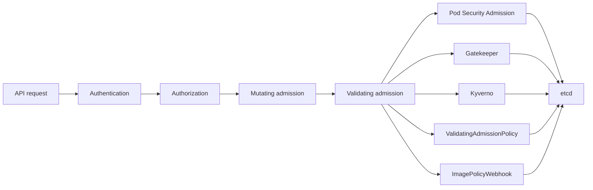

# CKS Minimize Microservice Vulnerabilities (20%)

Domain 4 is the joint-heaviest domain on the CKS exam. The published curriculum document is
v1.34; the exam environment runs Kubernetes v1.35, so write manifests against v1.35 APIs. The
domain covers what stops one compromised workload from becoming a compromised cluster: admission
control that rejects bad pods, encryption that makes a stolen etcd snapshot useless, a sandboxed
runtime that keeps a container off the host kernel, and encrypted pod-to-pod traffic.

Four recipes below run on a control plane or worker node as root, and one edits
`/etc/kubernetes/manifests/kube-apiserver.yaml`, so the backup habit from the cluster hardening
note applies without exception. Every task host has `kubectl` with a `k` alias, `yq`, `curl`,
`wget` and `man`. There is no `jq`, so no command in this note uses it.

<!-- toc -->
## Table of Contents

- [What the exam asks](#what-the-exam-asks)
- [Isolation techniques](#isolation-techniques)
- [Recipe 1: Enforce a Pod Security Standard and list the violators](#recipe-1-enforce-a-pod-security-standard-and-list-the-violators)
- [Recipe 2: Restrict registries with a Gatekeeper ConstraintTemplate and Constraint](#recipe-2-restrict-registries-with-a-gatekeeper-constrainttemplate-and-constraint)
- [Recipe 3: Restrict registries with a Kyverno ClusterPolicy](#recipe-3-restrict-registries-with-a-kyverno-clusterpolicy)
- [Recipe 4: Require non-root with a ValidatingAdmissionPolicy](#recipe-4-require-non-root-with-a-validatingadmissionpolicy)
- [Recipe 5: Encrypt Secrets at rest and re-encrypt the existing ones](#recipe-5-encrypt-secrets-at-rest-and-re-encrypt-the-existing-ones)
- [Recipe 6: Read a Secret from etcd and mount it safely](#recipe-6-read-a-secret-from-etcd-and-mount-it-safely)
- [Recipe 7: Run a pod in a gVisor sandbox with RuntimeClass](#recipe-7-run-a-pod-in-a-gvisor-sandbox-with-runtimeclass)
- [Recipe 8: Cilium L7 policy and WireGuard pod-to-pod encryption](#recipe-8-cilium-l7-policy-and-wireguard-pod-to-pod-encryption)
- [Recipe 9: Enforce Istio mTLS with PeerAuthentication STRICT](#recipe-9-enforce-istio-mtls-with-peerauthentication-strict)
- [Quick reference](#quick-reference)
- [Memorise](#memorise)

<!-- toc stop -->

## What the exam asks

| Task type | Sources | Drill |
|---|---|---|
| gVisor RuntimeClass and a sandboxed pod | 10 | Q12, Q28 (planned) |
| Secrets: encryption at rest, read from etcd, decode and mount | 8 | Q10, Q25 (planned), Q26 (planned) |
| Cilium: CiliumNetworkPolicy L3 to L7, transparent encryption | 8 | Q35 (planned) |
| Pod Security Admission via namespace labels | 6 | Q9, Q36 (planned) |
| OPA Gatekeeper constraint and template edits | 5 | Q11 |
| Istio mTLS with PeerAuthentication STRICT | 3 | Q44 (planned) |

Source counts are distinct candidate reports from the exam research report, section 3, rows 8,
12, 15, 19, 21 and 27. gVisor is the most reported task type in this domain, and the secrets pair
costs the most time when the re-encryption step is forgotten.



Order matters. A request that fails authorization never reaches admission, so a policy that seems
not to fire may be sitting behind an RBAC denial. Mutating webhooks run before validating ones,
which is why a Kyverno mutate rule can make a pod pass a Gatekeeper constraint that would
otherwise reject it. Nothing reaches etcd until every validating plugin has agreed.

## Isolation techniques

| Technique | What it isolates | What it does not isolate |
|---|---|---|
| Namespace | Names, RBAC scope, quota scope, label selectors | Traffic, nodes, the kernel; pods in different namespaces talk freely by default |
| RBAC | Which subjects may call which API verbs on which resources | Anything a pod does once running; RBAC never sees traffic or syscalls |
| NetworkPolicy | Pod-to-pod and pod-to-external traffic at L3 and L4 | HTTP methods and paths unless the CNI adds L7; traffic on the node itself |
| ResourceQuota | CPU, memory, storage and object counts per namespace | Nothing security relevant; it stops noisy neighbours, not attackers |
| Pod Security Admission | Which pod specs may be created in a namespace | Pods already running, and anything outside the pod spec such as images |
| Sandboxed runtime | The host kernel from container syscalls, via gVisor or Kata | The network, the API server, or a mounted host path |
| Dedicated nodes | Workloads from each other at machine level, via taints and selectors | Nothing on its own; without NetworkPolicy the pods still reach each other |

No row is a boundary by itself. The exam rewards stacking them: a namespace labelled
`restricted`, a default-deny NetworkPolicy, a non-root read-only container, and a sandbox for
anything genuinely untrusted.

## Recipe 1: Enforce a Pod Security Standard and list the violators

**Goal.** The namespace carries the requested `enforce`, `warn` and `audit` labels, new violating
pods are rejected, and the pods that already violate the standard are written to the answer file.

**Frequency.** 6 candidate sources (research section 3 row 15; `../practice-tests/exam-questions/cks-real-exam-questions.md`). Drill: Q9, Q36 (planned).

**Commands.**

```bash
# Three modes are three separate labels. Only enforce rejects anything.
k label ns prod --overwrite \
  pod-security.kubernetes.io/enforce=restricted \
  pod-security.kubernetes.io/warn=restricted \
  pod-security.kubernetes.io/audit=restricted
k label ns prod --overwrite pod-security.kubernetes.io/enforce-version=v1.35

# List the pods that already violate a standard, without enabling it.
# --dry-run=server runs the real admission check and warns once per offending pod.
k label --dry-run=server --overwrite ns prod \
  pod-security.kubernetes.io/enforce=baseline 2>&1 \
  | grep -v '^namespace/' > /opt/course/4/logs
```

```yaml
# A pod that satisfies restricted. Five fields, in these two places.
spec:
  securityContext:
    runAsNonRoot: true
    seccompProfile: {type: RuntimeDefault}
  containers:
  - name: app
    image: nginx:1.27.1
    securityContext:
      allowPrivilegeEscalation: false
      capabilities: {drop: ["ALL"]}
```

**Verify.**

```bash
k get ns prod --show-labels
k apply -f - <<'EOF'
apiVersion: v1
kind: Pod
metadata: {name: bad, namespace: prod}
spec:
  containers:
  - {name: c, image: nginx:1.27.1, securityContext: {privileged: true}}
EOF
# expected: Error from server (Forbidden): ... violates PodSecurity "restricted:v1.35"
cat /opt/course/4/logs
```

**Gotchas.**

- `enforce` blocks admission of new pods only. Pods already running keep running, which is why the task asks for a list of violators rather than a clean namespace.
- A violating Deployment is still accepted. The rejection happens when the ReplicaSet creates pods, so read `k -n prod get events` or `describe rs`, not the Deployment.
- The prefix is `pod-security.kubernetes.io/` and the value is `privileged`, `baseline` or `restricted`. A typo in either is accepted as an ordinary label and enforces nothing.
- Without `--overwrite`, relabelling a namespace that already has the label fails outright.
- `restricted` needs `runAsNonRoot`, `allowPrivilegeEscalation: false`, `capabilities.drop: ["ALL"]` and `seccompProfile.type` of `RuntimeDefault` or `Localhost`. Seccomp is the field people leave out.
- Never label `kube-system`. Its pods are privileged by design and enforcement breaks the cluster.

**Docs.** Search kubernetes.io for "Pod Security Standards" and "Enforce Pod Security Standards with Namespace Labels".

## Recipe 2: Restrict registries with a Gatekeeper ConstraintTemplate and Constraint

**Goal.** Gatekeeper rejects any pod whose image does not start with an allowed registry prefix,
through a `ConstraintTemplate` carrying the Rego and a `Constraint` carrying parameters and scope.

**Frequency.** 5 candidate sources (research section 3 row 21; `../practice-tests/exam-questions/cks-real-exam-questions.md`). Drill: Q11.

**Commands.**

```bash
# Gatekeeper is pre-installed on the exam. Read what exists before writing anything.
k get constrainttemplates
k get constraints
k edit k8sblockedregistries only-internal-registry     # the usual exam variant
```

```yaml
apiVersion: templates.gatekeeper.sh/v1
kind: ConstraintTemplate
metadata:
  name: k8sblockedregistries
spec:
  crd:
    spec:
      names:
        kind: K8sBlockedRegistries
      validation:
        openAPIV3Schema:
          type: object
          properties:
            allowedPrefixes:
              type: array
              items: {type: string}
  targets:
  - target: admission.k8s.gatekeeper.sh
    rego: |
      package k8sblockedregistries

      violation[{"msg": msg}] {
        c := all_containers[_]
        not allowed(c.image)
        msg := sprintf("image %v is not from an allowed registry %v",
                       [c.image, input.parameters.allowedPrefixes])
      }

      allowed(image) {
        startswith(image, input.parameters.allowedPrefixes[_])
      }

      all_containers[c] { c := input.review.object.spec.containers[_] }
      all_containers[c] { c := input.review.object.spec.initContainers[_] }
---
# The Constraint kind equals spec.crd.spec.names.kind above.
apiVersion: constraints.gatekeeper.sh/v1beta1
kind: K8sBlockedRegistries
metadata: {name: only-internal-registry}
spec:
  enforcementAction: deny
  match:
    kinds:
    - {apiGroups: [""], kinds: ["Pod"]}
    namespaces: ["prod", "dev"]
  parameters:
    allowedPrefixes: ["registry.internal/"]
```

**Verify.**

```bash
k get constrainttemplate k8sblockedregistries -o jsonpath='{.status.created}{"\n"}'
k -n prod run bad --image=docker.io/nginx:1.27.1
# expected: admission webhook "validation.gatekeeper.sh" denied the request:
#           [only-internal-registry] image docker.io/nginx:1.27.1 is not from an allowed registry
k -n prod run good --image=registry.internal/nginx:1.27.1
k get k8sblockedregistries only-internal-registry -o jsonpath='{.status.totalViolations}{"\n"}'
k get k8sblockedregistries only-internal-registry -o yaml | yq '.status.violations'
```

**Gotchas.**

- Never install Gatekeeper during the exam. It is already there, and the task is an edit of an existing template or constraint.
- The rule must be named `violation` and return an object with a `msg` key. A rule named `deny` compiles and never fires.
- Negation over a parameter list is unsafe in Rego, which is why `allowed(image)` exists as a helper instead of `not startswith(...)` inline.
- Applying the Constraint straight after the template can fail with "no matches for kind". The template creates a CRD first; wait a few seconds and reapply.
- `enforcementAction` takes `deny`, `warn` or `dryrun`. `dryrun` records `status.violations` and blocks nothing, which is what "report only" means.
- Constraints act at admission. Existing pods are found by the audit controller, which runs about every 60 seconds.

**Docs.** Not on the allowed list. Memorise the template and constraint shape, or use the links in the task Quick Reference box.

## Recipe 3: Restrict registries with a Kyverno ClusterPolicy

**Goal.** A `ClusterPolicy` in enforce mode rejects any pod whose image is not pulled from the
approved registry, and the audit variant reports without blocking.

**Frequency.** 5 candidate sources (research section 3 row 21, admission control; `../practice-tests/exam-questions/cks-real-exam-questions.md`). Drill: Q11, Q14.

**Commands.**

```yaml
apiVersion: kyverno.io/v1
kind: ClusterPolicy
metadata: {name: restrict-image-registries}
spec:
  validationFailureAction: Enforce        # Audit only reports
  background: true
  rules:
  - name: validate-registry
    match:
      any:
      - resources: {kinds: [Pod]}
    validate:
      message: "images must be pulled from registry.internal"
      pattern:
        spec:
          containers:
          - image: "registry.internal/*"
  - name: check-non-root
    match:
      any:
      - resources: {kinds: [Pod], namespaces: [prod]}
    validate:
      message: "runAsNonRoot must be true"
      pattern:
        spec:
          =(securityContext):
            =(runAsNonRoot): true
```

```bash
k apply -f /root/kyverno-registry.yaml
k patch cpol restrict-image-registries --type=merge \
  -p '{"spec":{"validationFailureAction":"Enforce"}}'
```

**Verify.**

```bash
k get cpol
k get cpol restrict-image-registries -o jsonpath='{.spec.validationFailureAction}{"\n"}'
k -n prod run bad --image=docker.io/nginx:1.27.1
# expected: resource Pod/prod/bad was blocked due to the following policies
k -n prod run good --image=registry.internal/nginx:1.27.1
k get policyreport -A
```

**Gotchas.**

- `Enforce` blocks, `Audit` only writes a PolicyReport. Read which word the task uses; they are capitalised exactly like this.
- Kyverno 1.13 and later also accept the per-rule form `spec.rules[].validate.failureAction`, and the per-rule setting wins. Check for a leftover rule-level `Audit` when a policy refuses to block.
- The `=(field)` prefix means "if present, must match". Without it the field becomes mandatory and pods the task never meant to touch are rejected.
- A pattern under `containers` matches every container in the list, so one bad sidecar fails the whole pod.
- Kyverno also does `mutate`, `generate` and `verifyImages`. A task that says "add a missing label" wants `mutate`, not `validate`.

**Docs.** Not on the allowed list. Memorise the `ClusterPolicy` skeleton, or use the links in the task Quick Reference box.

## Recipe 4: Require non-root with a ValidatingAdmissionPolicy

**Goal.** A built-in CEL policy and its binding reject any Deployment in the target namespace
whose pod template does not set `runAsNonRoot: true`, with no third-party controller involved.

**Frequency.** No first-hand candidate report yet. Research section 3 row 21 marks
ValidatingAdmissionPolicy a plausible future task, since 2026 guides now teach it beside
Gatekeeper and Kyverno. Drill: none built.

**Commands.**

```yaml
apiVersion: admissionregistration.k8s.io/v1
kind: ValidatingAdmissionPolicy
metadata: {name: require-run-as-non-root}
spec:
  failurePolicy: Fail
  matchConstraints:
    resourceRules:
    - apiGroups: ["apps"]
      apiVersions: ["v1"]
      operations: ["CREATE", "UPDATE"]
      resources: ["deployments"]
  validations:
  - expression: >-
      has(object.spec.template.spec.securityContext) &&
      has(object.spec.template.spec.securityContext.runAsNonRoot) &&
      object.spec.template.spec.securityContext.runAsNonRoot == true
    message: "spec.template.spec.securityContext.runAsNonRoot must be true"
---
apiVersion: admissionregistration.k8s.io/v1
kind: ValidatingAdmissionPolicyBinding
metadata: {name: require-run-as-non-root-binding}
spec:
  policyName: require-run-as-non-root
  validationActions: ["Deny"]
  matchResources:
    namespaceSelector:
      matchLabels:
        kubernetes.io/metadata.name: prod
```

**Verify.**

```bash
k get validatingadmissionpolicy
k get validatingadmissionpolicybinding
k -n prod create deployment web --image=nginx:1.27.1
# expected: deployments.apps "web" is forbidden: ValidatingAdmissionPolicy
#           'require-run-as-non-root' denied request: ... runAsNonRoot must be true
```

**Gotchas.**

- The policy alone does nothing. Without a `ValidatingAdmissionPolicyBinding` it is inert, which is the usual reason a correct-looking policy never fires.
- `validationActions` must be `["Deny"]` to block. `["Warn"]` and `["Audit"]` let the object through.
- CEL evaluates eagerly. A missing field raises an evaluation error rather than returning false, so guard every optional path with `has(...)`.
- `matchConstraints` picks the resource being validated. A Deployment-scoped policy never sees the pod the ReplicaSet later creates.
- `failurePolicy: Fail` turns an evaluation error into a rejection, which is usually wanted but makes a bad expression break the namespace.

**Docs.** Search kubernetes.io for "Validating Admission Policy" and "Common Expression Language in Kubernetes".

## Recipe 5: Encrypt Secrets at rest and re-encrypt the existing ones

**Goal.** The API server writes Secrets through an `aescbc` provider, every Secret already in the
cluster has been rewritten so it is encrypted too, and a raw etcd read shows the
`k8s:enc:aescbc:v1:` prefix instead of readable text.

**Frequency.** 8 candidate sources (research section 3 row 12; `../practice-tests/exam-questions/cks-real-exam-questions.md`). Drill: Q10, Q26 (planned).

**Commands.**

```bash
# All of this runs on the control plane node as root.
head -c 32 /dev/urandom | base64          # 1. aescbc needs exactly 32 bytes
mkdir -p /etc/kubernetes/enc
vim /etc/kubernetes/enc/enc.yaml          # 2. write the config below
chmod 600 /etc/kubernetes/enc/enc.yaml
cp /etc/kubernetes/manifests/kube-apiserver.yaml /root/kube-apiserver.yaml.bak
vim /etc/kubernetes/manifests/kube-apiserver.yaml   # 3. the three edits below
```

```yaml
# /etc/kubernetes/enc/enc.yaml
# The FIRST provider encrypts new writes. identity LAST keeps old plaintext readable.
apiVersion: apiserver.config.k8s.io/v1
kind: EncryptionConfiguration
resources:
- resources:
  - secrets
  providers:
  - aescbc:
      keys:
      - name: key1
        secret: PASTE_THE_BASE64_KEY_HERE
  - identity: {}
```

```yaml
# /etc/kubernetes/manifests/kube-apiserver.yaml: flag, then mount, then volume.
spec:
  containers:
  - command:
    - kube-apiserver
    - --encryption-provider-config=/etc/kubernetes/enc/enc.yaml
    volumeMounts:
    - {name: enc, mountPath: /etc/kubernetes/enc, readOnly: true}
  volumes:
  - name: enc
    hostPath: {path: /etc/kubernetes/enc, type: DirectoryOrCreate}
```

```bash
watch crictl ps                           # 4. wait for the static pod to restart
curl -k https://127.0.0.1:6443/readyz
k get secrets -A -o json | k replace -f -  # 5. re-encrypt everything that exists
```

**Verify.**

```bash
k -n default create secret generic enc-check --from-literal=password=s3cret
ETCDCTL_API=3 etcdctl \
  --cacert=/etc/kubernetes/pki/etcd/ca.crt \
  --cert=/etc/kubernetes/pki/etcd/server.crt \
  --key=/etc/kubernetes/pki/etcd/server.key \
  get /registry/secrets/default/enc-check | hexdump -C | head -3
# expected: the value begins k8s:enc:aescbc:v1:key1 and "s3cret" appears nowhere
k -n default get secret enc-check -o jsonpath='{.data.password}' | base64 -d; echo
```

**Gotchas.**

- Provider order is the whole task. The first provider encrypts writes; every provider in the list can decrypt reads. `identity` first silently disables encryption while the file still looks right.
- A key that is not exactly 32 bytes before base64 stops the API server from starting. Use `head -c 32 /dev/urandom | base64` and nothing else.
- The flag alone crashloops the API server with "no such file or directory". The `volumeMounts` entry and the `hostPath` volume are both mandatory, because the API server runs in a container.
- `kubectl get secrets -A -o json | kubectl replace -f -` is the forgotten step. Encryption applies to new writes only, so untouched Secrets stay plaintext forever.
- Check `ls /etc/kubernetes/pki/etcd/` before typing the etcd flags. Some clusters ship `healthcheck-client.crt` rather than `server.crt`; use the pair that exists.
- Encrypting ConfigMaps as well needs `configmaps` listed under `resources`. Read which the task names.
- To reverse the change, move `identity` to the front, restart the API server, then run the same replace command.

**Docs.** Search kubernetes.io for "Encrypting Confidential Data at Rest". etcd.io/docs is also allowed.

## Recipe 6: Read a Secret from etcd and mount it safely

**Goal.** Recover the plaintext of a Secret directly from etcd, decode it through the API without
`jq`, and hand it to a pod as a read-only volume rather than an environment variable.

**Frequency.** 8 candidate sources (research section 3 row 12; `../practice-tests/exam-questions/cks-real-exam-questions.md`). Drill: Q25 (planned).

**Commands.**

```bash
# Straight out of etcd on the control plane node. Without encryption the value is
# plain base64 inside the record and legible in the raw output.
ETCDCTL_API=3 etcdctl \
  --cacert=/etc/kubernetes/pki/etcd/ca.crt \
  --cert=/etc/kubernetes/pki/etcd/server.crt \
  --key=/etc/kubernetes/pki/etcd/server.key \
  get /registry/secrets/prod/db-creds
# Add --prefix --keys-only against /registry/secrets when the namespace is not named.

# Through the API instead. No jq, so jsonpath, go-template or yq.
k -n prod get secret db-creds -o jsonpath='{.data.password}' | base64 -d; echo
k -n prod get secret db-creds -o yaml | yq '.data | map_values(@base64d)'
k -n prod get secret db-creds \
  -o go-template='{{range $k,$v := .data}}{{$k}}={{$v | base64decode}}{{"\n"}}{{end}}'
k -n prod get secret tls-cert -o jsonpath='{.data.tls\.crt}' | base64 -d | head -2
```

```yaml
# Volume beats env. Mark the Secret immutable once the value is final.
apiVersion: v1
kind: Secret
metadata: {name: db-creds, namespace: prod}
immutable: true
stringData: {password: s3cret}
---
apiVersion: v1
kind: Pod
metadata: {name: app, namespace: prod}
spec:
  containers:
  - name: app
    image: nginx:1.27.1
    volumeMounts:
    - {name: creds, mountPath: /etc/creds, readOnly: true}
  volumes:
  - name: creds
    secret: {secretName: db-creds, defaultMode: 0400}
```

**Verify.**

```bash
k -n prod exec app -- cat /etc/creds/password; echo
k -n prod exec app -- ls -l /etc/creds
k -n prod get secret db-creds -o jsonpath='{.immutable}{"\n"}'
```

**Gotchas.**

- base64 is encoding, not encryption. A Secret that was never re-encrypted is readable by anyone holding the etcd data directory or a snapshot of it.
- Environment variables leak into `kubectl describe pod`, crash dumps and every child process. Mounted files do not, and they update in place when the Secret changes.
- `immutable: true` cannot be undone. Editing such a Secret fails; delete and recreate it.
- A `subPath` mount freezes the file at the value present when the pod started, so it never sees an update.
- A key name containing a dot needs the dot escaped in jsonpath, as in `{.data.tls\.crt}`.
- There is no `jq`. Only `base64 -d`, `go-template` with `base64decode`, or `yq` with `@base64d` produce plaintext.

**Docs.** Search kubernetes.io for "Secrets" and "Good practices for Kubernetes Secrets". etcd.io/docs is also allowed.

## Recipe 7: Run a pod in a gVisor sandbox with RuntimeClass

**Goal.** A `RuntimeClass` named `gvisor` points at the `runsc` handler, the pod runs under it on
the node where runsc is configured, and `dmesg` inside the pod shows the gVisor kernel.

**Frequency.** 10 candidate sources (research section 3 row 8; `../practice-tests/exam-questions/cks-real-exam-questions.md`). Drill: Q12, Q28 (planned).

**Commands.**

```bash
# On the worker node, confirm runsc exists and containerd knows the handler.
runsc --version
grep -A2 runsc /etc/containerd/config.toml
systemctl restart containerd
```

```toml
# /etc/containerd/config.toml. The name after .runtimes. is the handler name.
[plugins."io.containerd.grpc.v1.cri".containerd.runtimes.runsc]
  runtime_type = "io.containerd.runsc.v1"
```

```yaml
# RuntimeClass is cluster scoped. handler must equal the containerd runtime name.
apiVersion: node.k8s.io/v1
kind: RuntimeClass
metadata: {name: gvisor}
handler: runsc
---
apiVersion: v1
kind: Pod
metadata: {name: gvisor-test, namespace: default}
spec:
  runtimeClassName: gvisor
  nodeName: cks7262-node2         # runsc is configured only on this node
  containers:
  - {name: app, image: nginx:1.27.1}
```

**Verify.**

```bash
k get runtimeclass gvisor -o jsonpath='{.handler}{"\n"}'            # runsc
k get pod gvisor-test -o jsonpath='{.spec.runtimeClassName}{"\n"}'
k exec gvisor-test -- dmesg | head -3
# expected: "Starting gVisor..." followed by sandbox boot messages
k exec gvisor-test -- uname -r      # a gVisor kernel string, unlike the node's
k exec gvisor-test -- dmesg > /opt/course/10/gvisor-test-dmesg
head -3 /opt/course/10/gvisor-test-dmesg
```

**Gotchas.**

- `handler` is lowercase `runsc` and must match the containerd runtime name exactly. Using `gvisor` as the handler is the classic wrong answer.
- Only one node usually has runsc. Without `nodeName` or a matching `nodeSelector` the pod can schedule elsewhere and fail with `CreateContainerError` and "failed to get sandbox runtime".
- `RuntimeClass` has no namespace. Adding one makes the apply fail.
- A pod naming a RuntimeClass that does not exist stays `Pending` with a scheduling error, not a container error. The difference tells you which mistake you made.
- `dmesg` in a normal container prints the host ring buffer or is denied outright. The gVisor banner is the proof the sandbox is active.
- Redirect the `kubectl exec` output on the exam host. A redirect placed after `--` writes the file inside the container, where the grader never looks.

**Docs.** Search kubernetes.io for "Runtime Class" and "Container Runtimes".

## Recipe 8: Cilium L7 policy and WireGuard pod-to-pod encryption

**Goal.** A `CiliumNetworkPolicy` allows only the named HTTP method and path between two
workloads, and pod-to-pod traffic on the node network is encrypted with WireGuard.

**Frequency.** 8 candidate sources (research section 3 row 19; `../practice-tests/exam-questions/cks-real-exam-questions.md`). Drill: Q35 (planned).

**Commands.**

```yaml
# L3 by endpoint label, L4 by port, L7 by HTTP method and path, in one policy.
apiVersion: cilium.io/v2
kind: CiliumNetworkPolicy
metadata: {name: allow-frontend-get, namespace: prod}
spec:
  endpointSelector:
    matchLabels: {app: backend}
  ingress:
  - fromEndpoints:
    - matchLabels: {app: frontend}
    toPorts:
    - ports:
      - {port: "8080", protocol: TCP}
      rules:
        http:
        - {method: "GET", path: "/api/.*"}
```

```bash
k apply -f /root/cnp.yaml
# Transparent encryption. Graders have expected the Helm path, not the cilium CLI.
helm upgrade cilium cilium/cilium --namespace kube-system --reuse-values \
  --set encryption.enabled=true --set encryption.type=wireguard
k -n kube-system rollout restart ds/cilium
```

**Verify.**

```bash
k -n prod get cnp
k -n kube-system exec ds/cilium -- cilium status | grep -i encryption
k -n kube-system exec ds/cilium -- cilium encrypt status
# expected: Encryption: Wireguard, with a peer count above zero
k -n prod exec deploy/frontend -- curl -s -o /dev/null -w '%{http_code}\n' http://backend:8080/api/v1
# expected: 200
k -n prod exec deploy/frontend -- curl -s -o /dev/null -w '%{http_code}\n' -XPOST http://backend:8080/api/v1
# expected: 403 from the Envoy proxy, which proves the L7 rule is enforced
```

**Gotchas.**

- An L7 denial returns HTTP 403 immediately. An L3 or L4 denial hangs and times out. The failure mode says which layer rejected the request and saves minutes of guessing.
- `port` must be a quoted string in a `CiliumNetworkPolicy`. An unquoted integer fails CRD validation.
- `path` is a regular expression, so `/api` alone does not cover subpaths; `/api/.*` does.
- Any policy selecting an endpoint puts that endpoint into default deny for the direction it covers, so adding one ingress rule silently blocks every other ingress source.
- Standard `NetworkPolicy` objects still apply alongside Cilium ones. Both are allow-lists, so a pod needs a matching rule in each.
- Only docs.cilium.io is allowed in the exam browser. The Cilium Network Policy Editor site is not, so the YAML shape comes from the docs or from memory.
- `cilium status` and `cilium encrypt status` run inside the agent pod, hence `exec ds/cilium`. There is no `cilium` binary on the task host.

**Docs.** docs.cilium.io/en/stable is on the allowed list. Search it for "Layer 7 Examples" and "WireGuard Transparent Encryption".

## Recipe 9: Enforce Istio mTLS with PeerAuthentication STRICT

**Goal.** Workloads accept only mutually authenticated TLS from other sidecars, and a plaintext
request from a pod without a sidecar fails.

**Frequency.** 3 candidate sources (research section 3 row 27; `../practice-tests/exam-questions/cks-real-exam-questions.md`). Drill: Q44 (planned).

**Commands.**

```yaml
# Mesh wide: named default, in the Istio root namespace, with no selector.
apiVersion: security.istio.io/v1
kind: PeerAuthentication
metadata: {name: default, namespace: istio-system}
spec:
  mtls: {mode: STRICT}
---
# Namespace scope: named default, in the target namespace, still no selector.
apiVersion: security.istio.io/v1
kind: PeerAuthentication
metadata: {name: default, namespace: prod}
spec:
  mtls: {mode: STRICT}
---
# Workload scope: a selector narrows it and overrides the namespace policy.
apiVersion: security.istio.io/v1
kind: PeerAuthentication
metadata: {name: backend-strict, namespace: prod}
spec:
  selector:
    matchLabels: {app: backend}
  mtls: {mode: STRICT}
```

```bash
k apply -f /root/peerauth.yaml
k label ns prod istio-injection=enabled --overwrite
k -n prod rollout restart deploy
```

**Verify.**

```bash
k get peerauthentication -A
k -n prod get peerauthentication default -o jsonpath='{.spec.mtls.mode}{"\n"}'   # STRICT
istioctl x describe pod -n prod backend-xxxxx        # expect "mTLS mode: STRICT"
k -n legacy exec curlpod -- curl -s -m 5 -o /dev/null -w '%{http_code}\n' http://backend.prod:8080
# expected: 000 or a connection reset, because the caller has no sidecar
k -n prod exec deploy/frontend -c frontend -- curl -s -o /dev/null -w '%{http_code}\n' http://backend:8080
# expected: 200
```

**Gotchas.**

- A mesh-wide policy must be named `default` and live in the Istio root namespace, normally `istio-system`. The same object elsewhere applies to that namespace only.
- Precedence runs workload selector, then namespace, then mesh. A leftover `PERMISSIVE` workload policy quietly defeats a correct mesh-wide `STRICT`.
- Mode values are uppercase: `STRICT`, `PERMISSIVE`, `DISABLE`, `UNSET`. Lowercase is rejected by the CRD.
- `PERMISSIVE` accepts both mTLS and plaintext. If the task says legacy clients must keep working, that is the answer, not `STRICT`.
- Labelling the namespace does not inject sidecars into running pods. Restart the deployments, then confirm each pod has two containers.
- `PeerAuthentication` decides how callers authenticate, not who may call what. That is `AuthorizationPolicy`.

**Docs.** istio.io/latest/docs is on the allowed list. Search it for "Peer Authentication" and "Mutual TLS Migration".

## Quick reference

```bash
# Pod Security Admission
k label ns NS --overwrite pod-security.kubernetes.io/enforce=restricted
k label ns NS --overwrite pod-security.kubernetes.io/enforce-version=v1.35
k label --dry-run=server --overwrite ns NS pod-security.kubernetes.io/enforce=baseline 2>&1 | grep -v '^namespace/'

# Gatekeeper and Kyverno
k get constrainttemplates && k get constraints
k edit k8sblockedregistries NAME
k get k8sblockedregistries NAME -o jsonpath='{.status.totalViolations}{"\n"}'
k get cpol
k patch cpol NAME --type=merge -p '{"spec":{"validationFailureAction":"Enforce"}}'

# Secrets encryption at rest
head -c 32 /dev/urandom | base64
cp /etc/kubernetes/manifests/kube-apiserver.yaml /root/kube-apiserver.yaml.bak
# --encryption-provider-config=/etc/kubernetes/enc/enc.yaml plus volumeMount plus hostPath volume
k get secrets -A -o json | k replace -f -

# Raw etcd read (control plane node, as root)
ETCDCTL_API=3 etcdctl \
  --cacert=/etc/kubernetes/pki/etcd/ca.crt \
  --cert=/etc/kubernetes/pki/etcd/server.crt \
  --key=/etc/kubernetes/pki/etcd/server.key \
  get /registry/secrets/NS/NAME | hexdump -C | head -3

# Decoding Secrets without jq
k -n NS get secret NAME -o jsonpath='{.data.password}' | base64 -d; echo
k -n NS get secret NAME -o yaml | yq '.data | map_values(@base64d)'

# gVisor
grep -A2 runsc /etc/containerd/config.toml && systemctl restart containerd
k get runtimeclass gvisor -o jsonpath='{.handler}{"\n"}'
k exec POD -- dmesg > /opt/course/10/POD-dmesg

# Cilium and Istio
k -n kube-system exec ds/cilium -- cilium encrypt status
helm upgrade cilium cilium/cilium -n kube-system --reuse-values --set encryption.enabled=true --set encryption.type=wireguard
k -n NS get peerauthentication default -o jsonpath='{.spec.mtls.mode}{"\n"}'
```

Values worth knowing by heart:

| Setting | Correct value | Why the exam trips people |
|---|---|---|
| PSA label prefix | `pod-security.kubernetes.io/` | a typo becomes a harmless ordinary label |
| PSA modes | `enforce`, `audit`, `warn` | only `enforce` rejects anything |
| Encryption provider order | `aescbc` first, `identity` last | identity first silently disables encryption |
| Encryption key length | 32 bytes before base64 | any other length stops the API server |
| etcd ciphertext prefix | `k8s:enc:aescbc:v1:` | the only proof a grader accepts |
| RuntimeClass handler | `runsc` | `gvisor` is the RuntimeClass name, not the handler |
| CiliumNetworkPolicy port | quoted string | an integer fails CRD validation |
| PeerAuthentication mode | `STRICT` uppercase | lowercase is rejected by the CRD |

## Memorise

- PSA is three labels on a namespace and nothing else. `enforce` blocks new pods, `warn` and `audit` only report, and `--dry-run=server` on the label command lists the pods that already violate the standard.
- The `restricted` checklist is five fields: `runAsNonRoot: true`, `allowPrivilegeEscalation: false`, `capabilities.drop: ["ALL"]`, `seccompProfile.type: RuntimeDefault`, and no host namespaces or privileged containers.
- A violating Deployment is admitted; its ReplicaSet is what fails. Read events, not the Deployment.
- Gatekeeper is a `ConstraintTemplate` carrying Rego plus a `Constraint` carrying parameters and scope. The rule must be called `violation` and return `{"msg": msg}`. Never install Gatekeeper during the exam.
- `enforcementAction: dryrun` reports without blocking. Kyverno's equivalent is `validationFailureAction: Audit` against `Enforce`.
- A `ValidatingAdmissionPolicy` does nothing without a binding whose `validationActions` is `["Deny"]`.
- Encryption at rest is four steps: generate a 32-byte key, write the `EncryptionConfiguration` with `aescbc` first and `identity` last, add `--encryption-provider-config` plus a `volumeMounts` entry and a `hostPath` volume, then run `kubectl get secrets -A -o json | kubectl replace -f -`.
- The proof of encryption is the `k8s:enc:aescbc:v1:` prefix in a raw etcd read. The three etcd flags are `--cacert`, `--cert` and `--key`, all under `/etc/kubernetes/pki/etcd/`.
- base64 in a Secret is encoding, not encryption. Mount Secrets as read-only volumes rather than environment variables, and set `immutable: true` once the value is final.
- gVisor is `handler: runsc` on a cluster-scoped `RuntimeClass`, `runtimeClassName: gvisor` on the pod, and node targeting so the pod lands where containerd knows the handler. Prove it with `dmesg` inside the pod.
- Cilium L7 rejections come back as HTTP 403; L3 and L4 rejections time out. `cilium status` and `cilium encrypt status` run inside the agent pod through `exec ds/cilium`.
- Istio mesh-wide mTLS is a `PeerAuthentication` named `default` in `istio-system` with `mtls.mode: STRICT`. Workload selector beats namespace, and namespace beats mesh.
- Allowed docs in this domain are kubernetes.io, etcd.io, docs.cilium.io and istio.io. Gatekeeper and Kyverno documentation is not allowed, so their YAML shapes must be memorised.
- There is no `jq` on the exam hosts. Use `-o jsonpath`, `-o go-template`, `-o custom-columns` or `yq`.
