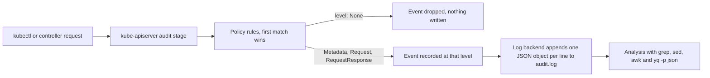

# CKS Monitoring, Logging and Runtime Security (20%)

Monitoring, Logging and Runtime Security is 20 percent of the CKS exam, the joint largest domain, and it contains the single most reported task family on the whole exam. Falco appears in 15 independent candidate sources, and two of the three first-hand failure write-ups blame it. Audit logging is second at 13 sources. Neither is skippable.

The exam environment runs Kubernetes v1.35. The published curriculum document is still labelled v1.34; nothing in this domain depends on the difference.

falco.org/docs is one of the eight documentation sources allowed during the exam, so Falco field names and rule syntax can be looked up while the timer runs. Search the "Supported Fields" page for output fields and the "Rules" page for condition syntax. Everything else here comes from kubernetes.io or from memory. Task hosts carry `kubectl` with a `k` alias, `yq`, `curl`, `wget` and `man`. There is no `jq`, so Recipe 5 mines JSON audit events with `grep`, `sed`, `awk` and `yq -p json`.

<!-- toc -->
## Table of Contents

- [What the exam asks](#what-the-exam-asks)
- [Recipe 1: Write or override a Falco rule](#recipe-1-write-or-override-a-falco-rule)
- [Recipe 2: Change the Falco output format and capture it to a file](#recipe-2-change-the-falco-output-format-and-capture-it-to-a-file)
- [Recipe 3: Map a Falco alert back to a pod and stop it](#recipe-3-map-a-falco-alert-back-to-a-pod-and-stop-it)
- [Recipe 4: Enable API server audit logging with a policy](#recipe-4-enable-api-server-audit-logging-with-a-policy)
- [Recipe 5: Investigate the audit log without jq](#recipe-5-investigate-the-audit-log-without-jq)
- [Recipe 6: Read behaviour as attack phases and trace syscalls](#recipe-6-read-behaviour-as-attack-phases-and-trace-syscalls)
- [Recipe 7: Make a container immutable at runtime](#recipe-7-make-a-container-immutable-at-runtime)
- [Quick reference](#quick-reference)
- [Memorise](#memorise)

<!-- toc stop -->

## What the exam asks

| Task type | Sources | Drill |
|---|---|---|
| Falco: write or modify a rule and read its alerts | 15 | Q16 |
| Falco: produce alerts in a required output format | 15 | Q19 (planned) |
| Falco: map an alert to a pod and scale the Deployment to zero | 15 | Q31 (planned) |
| Audit logging: policy plus the five flags and two volumes | 13 | Q17, Q32 (planned) |
| Audit forensics: reconstruct a break-in from the log | 13 | Q20 (planned) |
| Container immutability: read-only root filesystem | 6 | Q18 |
| strace and syscall activity investigation | 5 | Q43 (planned) |

Sources are distinct candidate reports counted in the exam research report, section 3, rows 1, 2, 16 and 20. Falco and audit logging both sit in the top tier reported by 10 or more sources, so plan on meeting at least one of each in a 16-task exam.



## Recipe 1: Write or override a Falco rule

**Goal.** A rule that fires on the described behaviour, loaded by the running Falco service, without editing the shipped rule file.

**Frequency.** 15 candidate sources (research section 3 row 1; `../practice-tests/exam-questions/cks-real-exam-questions.md`). Drill: Q16.

**Commands.**
```bash
sudo -i

# Which unit is running. Modern packages ship falco-modern-bpf; older ones ship falco.
systemctl status falco-modern-bpf 2>/dev/null || systemctl status falco
ls -l /etc/falco/
#   falco.yaml               main config: which rule files load, which outputs are on
#   falco_rules.yaml         rules shipped by the package, treat as read only
#   falco_rules.local.yaml   your overrides and additions, loaded LAST so it wins
#   rules.d/                 extra rule files on some builds, also loaded

# Read the shipped rule the task refers to before changing anything.
grep -n -A 12 'rule: Terminal shell in container' /etc/falco/falco_rules.yaml

# Override it by re-declaring the SAME rule name in the local file.
cat >> /etc/falco/falco_rules.local.yaml <<'EOF'
- rule: Terminal shell in container
  desc: A shell was spawned inside a container
  condition: >
    spawned_process and container
    and proc.name in (bash, sh, zsh, ash, ksh)
  output: "Shell in container %evt.time %container.id %container.name %user.name %proc.cmdline"
  priority: WARNING
  tags: [container, shell, mitre_execution]
EOF

# A brand new rule uses a name that does not exist yet. Macros and lists are reusable.
cat >> /etc/falco/falco_rules.local.yaml <<'EOF'
- macro: package_mgmt
  condition: proc.name in (apt, apt-get, apk, yum, dnf, rpm, dpkg)
- list: watched_images
  items: [nginx, httpd]
- rule: Package management in watched container
  desc: A package manager ran inside a container built from a watched image
  condition: spawned_process and container and package_mgmt and container.image.repository in (watched_images)
  output: "%evt.time,%container.id,%container.name,%user.name"
  priority: ERROR
  tags: [container, process]
EOF

falco -L | grep -i 'shell in container'    # every loaded rule, by name
```
**Verify.**
```bash
# Parse the files without starting the service. A syntax error here would otherwise
# leave Falco dead after the restart.
falco --validate /etc/falco/falco_rules.local.yaml

systemctl restart falco-modern-bpf 2>/dev/null || systemctl restart falco
systemctl is-active falco-modern-bpf falco

kubectl exec -it web -n prod -- sh -c 'exit'     # trigger, then read the alert
journalctl -u falco-modern-bpf -u falco --since "-2 min" --no-pager | grep -i 'shell in container'
```
**Gotchas.**
- The local file is loaded after the shipped file, so a rule with the same `rule:` name replaces the shipped one entirely. Change the name and both rules fire, which usually fails the grader's format check.
- Never edit `/etc/falco/falco_rules.yaml`. Package upgrades overwrite it and several graders diff it.
- Falco 0.37 and newer print a deprecation warning when a rule is redefined by name and accept an explicit `override: {condition: replace, output: replace}` block instead. Re-declaring the name still works; read the warning rather than panicking.
- `condition` fields come from the falco.org "Supported Fields" page. `container.id != host` and the `container` macro both mean "not on the host"; the macro is the readable form.
- Valid `priority` values are EMERGENCY, ALERT, CRITICAL, ERROR, WARNING, NOTICE, INFORMATIONAL and DEBUG. A typo makes the whole file fail to load, and a condition spread over several lines needs the YAML folded scalar `>`.
- `falco --validate <file>` before every restart. It is the cheapest insurance in the domain.

**Docs.** falco.org/docs, "Rules" for the rule fields, macros and lists, and "Supported Fields" under Reference for the condition and output field names.

## Recipe 2: Change the Falco output format and capture it to a file

**Goal.** Alerts for the named rule are emitted as `%evt.time,%container.id,%container.name,%user.name` and the matching lines are written to the file the task names.

**Frequency.** 15 candidate sources (research section 3 row 1). Drill: Q19 (planned).

**Commands.**
```bash
sudo -i

# Find the exact field names. Never guess them.
falco --list | grep -E '^evt\.time|^container\.id|^container\.name|^user\.name'

# Rewrite only the output line of the rule, keeping the rule name identical.
vi /etc/falco/falco_rules.local.yaml
#  - rule: Terminal shell in container
#    desc: A shell was spawned inside a container
#    condition: spawned_process and container and proc.name in (bash, sh, zsh)
#    output: "%evt.time,%container.id,%container.name,%user.name"
#    priority: WARNING

# Turn on file output. It is off by default in every packaged install.
vi /etc/falco/falco.yaml
#  file_output:
#    enabled: true
#    keep_alive: false
#    filename: /var/log/falco.log
#  json_output: false          # true would wrap the line in JSON and break the format

# Reload. SIGHUP re-reads falco.yaml and every rule file.
kill -1 "$(cat /var/run/falco.pid)"
# or, when the pid file is absent or falco.yaml outputs changed:
systemctl restart falco-modern-bpf 2>/dev/null || systemctl restart falco
```
**Verify.**
```bash
falco --validate /etc/falco/falco_rules.local.yaml
systemctl is-active falco-modern-bpf falco

kubectl exec -it web -n prod -- sh -c 'exit'     # generate an alert, read both sinks
tail -5 /var/log/falco.log
journalctl -u falco-modern-bpf -u falco --since "-2 min" --no-pager | tail -5

# Falco prefixes every alert with "<time>: <priority> ". The rule output has no
# spaces, so the last field of the line is exactly what the task asked for.
mkdir -p /opt/course/19
grep 'Terminal shell in container' /var/log/falco.log | awk '{print $NF}' > /opt/course/19/falco.log
cat /opt/course/19/falco.log
# expect lines like: 14:22:07.113459382,3f1a9b2c7d10,nginx,root
```
**Gotchas.**
- Every field in `output` needs the `%` prefix. `%container.id` is a field, `container.id` is literal text.
- Commas with no spaces are what the grader diffs. `%evt.time, %container.id` with spaces fails the check.
- `file_output.enabled` is `false` in the shipped `falco.yaml`. Getting the rule format right and leaving file output off produces an empty deliverable. `filename` must be an absolute path in a directory that already exists.
- `json_output: true` rewrites the entire line as a JSON object, so it destroys the requested comma format. Leave it false unless the task asks for JSON.
- `kill -1` needs the real pid. When `/var/run/falco.pid` is missing use `kill -1 "$(pidof falco)"` or `systemctl show -p MainPID --value falco-modern-bpf`.
- Journal output is on by default through syslog; the file is not. Read both while testing so a missing file is obvious immediately.
- A candidate reported the Falco event stream stalling under exam load. If no alerts appear at all, restart the unit before rewriting the rule.

**Docs.** falco.org/docs, "Supported Fields" under Reference for the field list, and "Outputs" under Configuration for `file_output` and `json_output`.

## Recipe 3: Map a Falco alert back to a pod and stop it

**Goal.** The pod and namespace behind an alerted container id are identified, and the workload that keeps recreating it is scaled to zero.

**Frequency.** 15 candidate sources (research section 3 row 1). Drill: Q31 (planned).

**Commands.**
```bash
sudo -i    # crictl needs root and the runtime socket

# The alert carries a 12 character container id. crictl accepts the prefix.
ID=3f1a9b2c7d10
crictl ps --id "$ID"
crictl ps -a | grep "$ID"

# The pod name and namespace live in the container's Kubernetes labels.
crictl inspect "$ID" | grep -A 5 io.kubernetes.pod

# Same answer without paging through JSON, which matters with no jq on the host.
crictl inspect --output go-template --template \
  '{{index .status.labels "io.kubernetes.pod.namespace"}} {{index .status.labels "io.kubernetes.pod.name"}}' "$ID"

kubectl get pods -A -o wide | grep <pod-name>

# Walk the ownership chain: pod to ReplicaSet to Deployment.
kubectl get pod <pod> -n <ns> -o jsonpath='{.metadata.ownerReferences[*].name}{"\n"}'
kubectl get rs <replicaset> -n <ns> -o jsonpath='{.metadata.ownerReferences[*].name}{"\n"}'

kubectl scale deployment <deploy> -n <ns> --replicas=0
```
**Verify.**
```bash
kubectl get deploy <deploy> -n <ns> \
  -o jsonpath='{.spec.replicas}|{.status.readyReplicas}{"\n"}'
# expect: 0|

kubectl get pods -n <ns> -o wide
crictl ps | grep "$ID"                    # no output once the container is gone

# The alerts stop as well.
journalctl -u falco-modern-bpf -u falco --since "-1 min" --no-pager | tail -3
```
**Gotchas.**
- Deleting the pod is not the answer when a Deployment owns it. The ReplicaSet recreates it within seconds and the alerts resume. Scale the Deployment, or delete the Deployment if that is what the task says.
- `crictl` without `sudo -i` fails to reach the runtime socket. One reported exam failure was exactly this. If it still fails, add `--runtime-endpoint unix:///run/containerd/containerd.sock`.
- `crictl ps` shows only running containers. Use `crictl ps -a` when the container already exited, and `crictl pods` to list sandboxes by name.
- Container ids from Falco are short. Kubernetes reports the full id with a `containerd://` prefix in `.status.containerStatuses[*].containerID`, so a `grep` on the short id still matches.
- Read the deliverable. Some variants want the pod name and namespace written to a file under `/opt/course/`, not the workload stopped.

**Docs.** falco.org/docs for the alert fields. kubernetes.io "Debugging Kubernetes nodes with crictl" for the `crictl` subcommands and the runtime endpoint flag.

## Recipe 4: Enable API server audit logging with a policy

**Goal.** The API server writes JSON audit events to a file on the control plane node, filtered by a policy whose rules are ordered so the specific ones match first, and the API server still serves requests.

**Frequency.** 13 candidate sources (research section 3 row 2). Drill: Q17, Q32 (planned).

**Commands.**
```bash
sudo -i
cp /etc/kubernetes/manifests/kube-apiserver.yaml /root/kube-apiserver.yaml.bak
mkdir -p /etc/kubernetes/audit /var/log/kubernetes/audit

# Order matters: first matching rule wins, so specific rules come first and the
# catch-all comes last. A catch-all placed first swallows everything.
cat > /etc/kubernetes/audit/policy.yaml <<'EOF'
apiVersion: audit.k8s.io/v1
kind: Policy
omitStages:
- RequestReceived
rules:
# 1. Full request and response bodies for secrets in one namespace.
- level: RequestResponse
  namespaces: ["prod"]
  resources:
  - group: ""
    resources: ["secrets"]

# 2. Drop the read noise. Anything reaching here is a get, list or watch that rule 1 did not claim.
- level: None
  verbs: ["get", "list", "watch"]

# 3. Catch-all. No selectors, so it matches every remaining request.
- level: Metadata
EOF

vi /etc/kubernetes/manifests/kube-apiserver.yaml
```
```yaml
    # under spec.containers[0].command
    - --audit-policy-file=/etc/kubernetes/audit/policy.yaml
    - --audit-log-path=/var/log/kubernetes/audit/audit.log
    - --audit-log-maxage=30
    - --audit-log-maxbackup=10
    - --audit-log-maxsize=100

    # under spec.containers[0].volumeMounts
    volumeMounts:
    - name: audit-policy
      mountPath: /etc/kubernetes/audit/policy.yaml
      readOnly: true
    - name: audit-log
      mountPath: /var/log/kubernetes/audit/
      readOnly: false

  # under spec.volumes
  volumes:
  - name: audit-policy
    hostPath:
      path: /etc/kubernetes/audit/policy.yaml
      type: File
  - name: audit-log
    hostPath:
      path: /var/log/kubernetes/audit/
      type: DirectoryOrCreate
```
**Verify.**
```bash
crictl ps | grep kube-apiserver           # a fresh container, a few seconds old
kubectl get --raw='/readyz?verbose' | tail -3

ls -l /var/log/kubernetes/audit/audit.log

# Generate events, then confirm the levels landed as designed.
kubectl get secret -n prod
kubectl create secret generic audit-probe -n prod --from-literal=k=v
tail -1 /var/log/kubernetes/audit/audit.log | yq -p json -o yaml | head -20
grep -c '"level":"RequestResponse"' /var/log/kubernetes/audit/audit.log
grep -c '"level":"Metadata"' /var/log/kubernetes/audit/audit.log
grep '"verb":"get"' /var/log/kubernetes/audit/audit.log | wc -l   # expect 0 outside prod secrets
```
**Gotchas.**
- First match wins, and only the first match. A `level: Metadata` catch-all written above the `None` rule means the `None` rule never runs and the log fills with read noise.
- The catch-all rule has no `resources`, no `verbs` and no `namespaces`. Adding a selector to it stops it being a catch-all.
- `namespaces` is a field on the rule, beside `resources`, not inside a `resources` entry. Nesting it is the most common policy syntax error.
- `group: ""` is the core API group, which is where secrets, pods and configmaps live. `group: apps` covers Deployments.
- The policy volume uses `type: File` because it mounts a single file; the log volume uses `type: DirectoryOrCreate` because the directory may not exist yet. Mixing them up stops the API server.
- The log mount must not be read only. `readOnly: true` there leaves the API server unable to write and it crash-loops. Both `volumeMounts` and `volumes` are required; adding only the flags gives an API server that cannot find the policy file.
- Saving the manifest restarts the API server. The kubelet rescans `/etc/kubernetes/manifests` about every 20 seconds, so wait and watch rather than editing again.
- When `kubectl` starts hanging, read `journalctl -fu kubelet | grep -i apiserver`, then `crictl ps -a | grep apiserver` and `crictl logs <id>`, then the newest file under `/var/log/pods/kube-system_kube-apiserver-*/kube-apiserver/`. Restore `/root/kube-apiserver.yaml.bak` if the fix is not obvious in a minute.
- `omitStages: [RequestReceived]` roughly halves the log volume and is what almost every task wants.
- `--audit-log-maxage` is in days, `--audit-log-maxsize` in megabytes, `--audit-log-maxbackup` is a file count.

**Docs.** kubernetes.io "Auditing" for the policy shape and the flags, and "Audit Policy" in the config API reference for every field name.

## Recipe 5: Investigate the audit log without jq

**Goal.** Name the user, the source IP, the verb and the object involved in a described incident, using only the tools present on the exam host.

**Frequency.** 13 candidate sources (research section 3 row 2). Drill: Q20 (planned).

**Commands.**
```bash
cd /var/log/kubernetes/audit

# Every audit event is one JSON object on one line, so line tools work directly.
wc -l audit.log
ls -t audit.log*                          # rotated backups may hold the evidence

# Who deleted secrets.
grep '"verb":"delete"' audit.log | grep '"resource":"secrets"' | tail -5

# Rank the busiest identities. grep -o isolates the field, cut takes the value.
grep -o '"username":"[^"]*"' audit.log | cut -d'"' -f4 | sort | uniq -c | sort -rn | head

# Everything one identity did, verb by verb, and where it came from.
grep '"username":"system:serviceaccount:prod:app"' audit.log \
  | grep -o '"verb":"[^"]*"' | cut -d'"' -f4 | sort | uniq -c
grep '"username":"jane"' audit.log | grep -o '"sourceIPs":\["[^"]*"' | sed 's/.*\["//' | sort -u

# yq reads a stream of JSON objects with -p json. Use it on whole lines.
grep '"name":"admin-token"' audit.log | tail -1 | yq -p json -o yaml
grep '"verb":"delete"' audit.log \
  | yq -p json '[.user.username, .verb, .objectRef.resource, .objectRef.name] | join(" ")'

# Count events per hour to find the burst.
grep -o '"requestReceivedTimestamp":"[^"]*"' audit.log | cut -d'"' -f4 | cut -c1-13 | uniq -c

# Write the deliverable.
mkdir -p /opt/course/20
grep '"resource":"secrets"' audit.log | grep -o '"username":"[^"]*"' \
  | cut -d'"' -f4 | sort -u > /opt/course/20/users
```
**Verify.**
```bash
cat /opt/course/20/users
wc -l /opt/course/20/users

# Prove the extraction against the raw event it came from.
grep '"resource":"secrets"' audit.log | tail -1 | yq -p json \
  '.user.username + " " + .verb + " " + .objectRef.namespace + "/" + .objectRef.name'
```
**Gotchas.**
- There is no `jq` on the exam hosts. Every filter here is `grep`, `sed`, `awk`, `cut` or `yq -p json`.
- `grep -o '"field":"[^"]*"' | cut -d'"' -f4` is the fastest field extractor and works on any audit field. Learn the shape once and reuse it.
- `yq -p json` needs complete JSON objects on stdin. A `grep -o` fragment produces a parse error, and feeding the whole log to `yq` is slow, so narrow with `grep` first and pipe whole lines.
- The username lives at `.user.username`, but an impersonated request also carries `.impersonatedUser.username`. Check both before naming a culprit.
- `sourceIPs` is a JSON array, so the value sits after `["` and the simple `cut -d'"' -f4` pattern does not apply to it.
- The log rotates. When the incident is older than the task expects, search `audit.log.1` and the numbered backups too.
- Anything logged at `level: None` was never written. If the evidence is missing, the policy dropped it, and that itself is the answer to some variants.

**Docs.** kubernetes.io "Auditing" for the event schema and the field names used in the greps above. `man grep`, `man sed` and `yq --help` on the host.

## Recipe 6: Read behaviour as attack phases and trace syscalls

**Goal.** Turn a described suspicious behaviour into the right detection signal, and trace what a live process is actually doing on the node.

**Frequency.** 5 candidate sources for the strace variant (research section 3 row 20); the analytic part underpins the Falco and audit tasks above. Drill: Q43 (planned).

Map the behaviour to the phase, then to the tool that sees it. Rules that target behaviour survive; rules that target one binary name do not.

| Phase | What it looks like | Signal to use |
|---|---|---|
| Reconnaissance | API reads from a pod with a mounted token | Audit `get` and `list` by `system:serviceaccount:*` |
| Initial access | Shell spawned inside a container | Falco `spawned_process and container` |
| Execution | Package manager or compiler run in a container | Falco condition on `proc.name` in a package-manager list |
| Persistence | Write below `/bin`, `/etc` or a cron directory | Falco `open_write` with `fd.name startswith /etc` |
| Privilege escalation | New privileged pod, hostPath mount, `kill` syscalls | Audit `create` on pods plus strace on the process |
| Lateral movement | API calls from an unexpected identity or IP | Audit `sourceIPs` grouped by username |
| Exfiltration | Outbound connection from a container that never had one | Falco `outbound` macro, NetworkPolicy egress denials |

**Commands.**
```bash
sudo -i

# From a container to a host pid.
crictl ps --name <container-name>
PID=$(crictl inspect --output go-template --template '{{.info.pid}}' <container-id>)

strace -p "$PID" -f                       # everything, following children

# Only the syscall the task names, written to the deliverable file.
mkdir -p /opt/course/43
strace -p "$PID" -f -e trace=kill -o /opt/course/43/strace.log

# A summary instead of a stream, which is far easier to read under time pressure.
strace -p "$PID" -f -c

# Network and file activity variants.
strace -p "$PID" -f -e trace=network
strace -p "$PID" -f -e trace=openat,unlink

# Context around the process without attaching to it.
ls -l /proc/"$PID"/exe /proc/"$PID"/root
tr '\0' ' ' < /proc/"$PID"/cmdline; echo
grep -i seccomp /proc/"$PID"/status
```
**Verify.**
```bash
head -20 /opt/course/43/strace.log
grep -c 'kill(' /opt/course/43/strace.log
crictl inspect --output go-template --template '{{.info.pid}}' <container-id>   # pid still matches
```
**Gotchas.**
- `strace` attaches to a pid on the node, not to a container. Get the pid from `crictl inspect` first; guessing from `ps` picks up the wrong process on a busy node. Attaching needs root.
- Without `-f` the trace misses everything the process forks, which is usually the interesting part.
- `strace` prints to stderr. Use `-o <file>` for the deliverable rather than a shell redirect that captures nothing, and detach with Ctrl-C once enough lines are captured.
- Falco conditions naming one binary miss the same attack run under a different name. Target the behaviour: a shell in a container, a write below a binary directory, an unexpected outbound connection.
- `grep -i seccomp /proc/<pid>/status` returning `Seccomp: 2` proves a seccomp filter is loaded, which is the fastest confirmation for the seccomp tasks in note 03.

**Docs.** falco.org/docs "Supported Fields" for the condition fields behind each signal. kubernetes.io "Auditing" for the audit verbs. `man strace` on the host; there is no allowed online strace reference.

## Recipe 7: Make a container immutable at runtime

**Goal.** The container cannot write to its root filesystem, holds no extra privileges, and still runs because the paths it genuinely writes to are backed by `emptyDir`.

**Frequency.** 6 candidate sources (research section 3 row 16). Drill: Q18.

**Commands.**
```bash
# Find the offenders first. This is usually half the task.
kubectl get pods -n development -o custom-columns='POD:.metadata.name,PRIV:.spec.containers[*].securityContext.privileged,RO:.spec.containers[*].securityContext.readOnlyRootFilesystem'

kubectl get pods -n development \
  -o jsonpath='{range .items[*]}{.metadata.name}{" "}{.spec.volumes[*].hostPath.path}{"\n"}{end}'

kubectl get deploy web -n prod -o yaml > /tmp/web.bak.yaml && kubectl edit deploy web -n prod
```
```yaml
    spec:
      containers:
      - name: web
        image: nginx:1.27.1
        securityContext:
          readOnlyRootFilesystem: true
          allowPrivilegeEscalation: false
          privileged: false
          runAsNonRoot: true
          capabilities:
            drop: ["ALL"]
        volumeMounts:
        - {name: tmp, mountPath: /tmp}
        - {name: cache, mountPath: /var/cache/nginx}
        - {name: run, mountPath: /var/run}
      volumes:
      - {name: tmp, emptyDir: {}}
      - {name: cache, emptyDir: {}}
      - {name: run, emptyDir: {}}
```
**Verify.**
```bash
kubectl rollout status deploy/web -n prod

kubectl get deploy web -n prod -o jsonpath='{.spec.template.spec.containers[0].securityContext.readOnlyRootFilesystem}|{.spec.template.spec.containers[0].securityContext.privileged}{"\n"}'
# expect: true|false

# The root filesystem must reject the write.
kubectl exec -n prod deploy/web -- touch /x
# expect: touch: cannot touch '/x': Read-only file system

# The mounted paths must accept it, and the app must still be up.
kubectl exec -n prod deploy/web -- touch /tmp/x && echo tmp-writable
kubectl get pods -n prod -l app=web
```
**Gotchas.**
- `readOnlyRootFilesystem` alone crash-loops nginx, which writes to `/var/cache/nginx` and `/var/run`. Add the `emptyDir` mounts in the same edit, not afterwards.
- `readOnlyRootFilesystem`, `privileged`, `allowPrivilegeEscalation` and `capabilities` are container-level fields only. Putting them under `spec.securityContext` is silently ignored and the grader sees no change.
- `runAsNonRoot: true` fails the pod at admission time when the image's default user is root. Either the image has a `USER` line or the pod needs `runAsUser: <uid>` as well.
- An `emptyDir` is per pod and empty on every restart. It is the right answer for caches and scratch space, never for data the task says must survive.
- Some variants want offending pods deleted rather than fixed. Read whether the deliverable is a patched Deployment, a deleted pod, or a list of names in a file.
- Editing a Deployment rolls the pods automatically. Editing a bare pod does not, so recreate it with `kubectl replace --force -f /tmp/pod.yaml`. Save the YAML first; there is no undo in the exam.

**Docs.** kubernetes.io "Configure a Security Context for a Pod or Container". `kubectl explain pod.spec.containers.securityContext` is faster than the browser for field names.

## Quick reference

```bash
# Falco: files and service
ls /etc/falco/                       # falco.yaml, falco_rules.yaml, falco_rules.local.yaml, rules.d/
falco --validate /etc/falco/falco_rules.local.yaml
falco --list | grep container        # output field names
falco -L | grep -i shell             # loaded rules by name
kill -1 "$(cat /var/run/falco.pid)"  # SIGHUP reload
systemctl restart falco-modern-bpf 2>/dev/null || systemctl restart falco
journalctl -u falco-modern-bpf -u falco -f
tail -f /var/log/falco.log
grep '<rule name>' /var/log/falco.log | awk '{print $NF}' > /opt/course/<n>/falco.log

# Falco alert to pod
crictl ps --id <id>
crictl inspect --output go-template --template '{{index .status.labels "io.kubernetes.pod.name"}}' <id>
kubectl get pods -A -o wide | grep <pod>
kubectl scale deployment <deploy> -n <ns> --replicas=0

# Audit: the five flags
--audit-policy-file=/etc/kubernetes/audit/policy.yaml
--audit-log-path=/var/log/kubernetes/audit/audit.log
--audit-log-maxage=30
--audit-log-maxbackup=10
--audit-log-maxsize=100

# Audit: forensics without jq
grep -o '"username":"[^"]*"' audit.log | cut -d'"' -f4 | sort | uniq -c | sort -rn
grep '"verb":"delete"' audit.log | grep '"resource":"secrets"'
tail -1 audit.log | yq -p json -o yaml

# Control plane health after an apiserver edit
crictl ps | grep kube-apiserver
kubectl get --raw='/readyz?verbose' | tail -3
journalctl -fu kubelet | grep -i apiserver
ls -t /var/log/pods/kube-system_kube-apiserver-*/kube-apiserver/ | head -1

# strace and immutability
PID=$(crictl inspect --output go-template --template '{{.info.pid}}' <id>)
strace -p "$PID" -f -e trace=kill -o /opt/course/<n>/strace.log
kubectl exec -n <ns> deploy/<name> -- touch /x        # must fail
```

Audit levels, in increasing detail:

| Level | What is written | Use it for |
|---|---|---|
| `None` | nothing | dropping known-noisy verbs or resources |
| `Metadata` | who, when, verb, resource, no bodies | the catch-all rule |
| `Request` | metadata plus the request body | writes worth reviewing |
| `RequestResponse` | metadata plus request and response bodies | secrets and other high-value reads |

## Memorise

- Falco rules ship in `/etc/falco/falco_rules.yaml` and are overridden in `/etc/falco/falco_rules.local.yaml`, which loads last. Never edit the shipped file.
- A rule has `rule`, `desc`, `condition`, `output`, `priority` and optional `tags`. Overriding means re-declaring the same `rule:` name in the local file.
- `falco --list` prints the output field names; `falco -L` lists the loaded rules; `falco --validate <file>` parses without starting.
- The exam output format is `%evt.time,%container.id,%container.name,%user.name`, with the `%` on every field and no spaces around the commas.
- File output is off by default. Set `file_output.enabled: true` and `filename: /var/log/falco.log` in `/etc/falco/falco.yaml`, and leave `json_output: false`.
- Reload with `kill -1 "$(cat /var/run/falco.pid)"`, or restart the unit. The unit is `falco-modern-bpf` on current packages and `falco` on older ones, so try both.
- Read alerts with `journalctl -u falco-modern-bpf -u falco` or `tail -f /var/log/falco.log`. The rule output is the last field of the line, so `awk '{print $NF}'` extracts it.
- Alert to pod: `crictl ps --id`, then `crictl inspect` for the `io.kubernetes.pod.name` and `io.kubernetes.pod.namespace` labels, then `kubectl get pods -A`, then `kubectl scale deployment --replicas=0`.
- Audit policy rules are evaluated in order and the first match wins: specific rules first, `level: None` for `get`, `list` and `watch` next, the bare `level: Metadata` catch-all last.
- The five flags: `--audit-policy-file`, `--audit-log-path`, `--audit-log-maxage=30`, `--audit-log-maxbackup=10`, `--audit-log-maxsize=100`.
- Two hostPath volumes: the policy file with `type: File` mounted read only, the log directory with `type: DirectoryOrCreate` mounted writable. Both `volumeMounts` and `volumes` are needed.
- `cp /etc/kubernetes/manifests/kube-apiserver.yaml /root/kube-apiserver.yaml.bak` before touching the manifest, every time.
- There is no `jq`. Mine the audit log with `grep -o '"field":"[^"]*"' | cut -d'"' -f4`, and pretty-print whole lines with `yq -p json -o yaml`.
- `strace -p "$PID" -f -e trace=kill -o <file>`, with the pid from `crictl inspect --output go-template --template '{{.info.pid}}'`.
- Immutability is `readOnlyRootFilesystem: true`, `allowPrivilegeEscalation: false`, no `privileged`, `capabilities.drop: ["ALL"]`, plus an `emptyDir` for every path the app writes.
- `readOnlyRootFilesystem`, `privileged`, `allowPrivilegeEscalation` and `capabilities` are container-level fields; putting them at pod level does nothing.
- falco.org/docs is allowed in the exam. Search "Supported Fields" for output fields and "Rules" for condition syntax.
