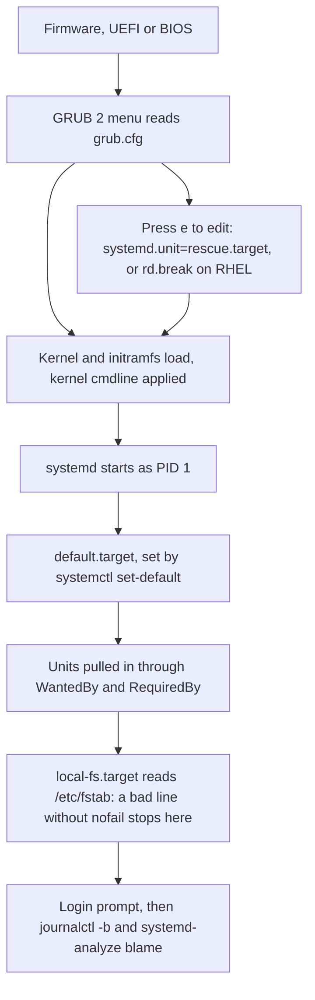

# LFCS Operations and Deployment (25%)

Operations and Deployment is 25 percent of the LFCS exam, tied with Networking as the largest domain. The exam is 17 to 20 performance-based tasks in 2 hours, and a score of 67 percent passes.

Every task runs on a designated host named in the task infobox. Reach it with `ssh <nodename>` from the `base` host, take root with `sudo -i`, and leave with `exit` before starting the next task. Nested SSH is not supported, and the `base` host must never be rebooted.

The only documentation allowed is what the terminal can reach: man pages, the files under `/usr/share/doc`, and the packages that ship with the distribution. There is no browser and no internet. Every recipe below therefore ends by naming the exact man page that carries the same information, so that the page can be found under exam pressure.

The most expensive mistake in this domain is a change that works in the current session and vanishes at the next boot. Each recipe states what makes the change persist, and each Verify block tests the live effect and the persistence separately.

<!-- toc -->
## Table of Contents

- [What the exam asks](#what-the-exam-asks)
- [Recipe 1: Kernel parameters, now and after a reboot](#recipe-1-kernel-parameters-now-and-after-a-reboot)
- [Recipe 2: Find the process hurting the host and tame it](#recipe-2-find-the-process-hurting-the-host-and-tame-it)
- [Recipe 3: Scheduled jobs with cron, at and systemd timers](#recipe-3-scheduled-jobs-with-cron-at-and-systemd-timers)
- [Recipe 4: Install, hold and validate software packages](#recipe-4-install-hold-and-validate-software-packages)
- [Recipe 5: Recover a host that will not boot or will not mount](#recipe-5-recover-a-host-that-will-not-boot-or-will-not-mount)
- [Recipe 6: Import a virtual machine from a qcow2 image with libvirt](#recipe-6-import-a-virtual-machine-from-a-qcow2-image-with-libvirt)
- [Recipe 7: Run a container with a memory limit and a restart policy](#recipe-7-run-a-container-with-a-memory-limit-and-a-restart-policy)
- [Recipe 8: Serve content on a custom port under SELinux enforcing](#recipe-8-serve-content-on-a-custom-port-under-selinux-enforcing)
- [Recipe 9: Write a systemd service unit for an application](#recipe-9-write-a-systemd-service-unit-for-an-application)
- [Recipe 10: Read the journal and make logging persistent](#recipe-10-read-the-journal-and-make-logging-persistent)
- [Recipe 11: Load, configure and blacklist kernel modules](#recipe-11-load-configure-and-blacklist-kernel-modules)
- [Ubuntu vs Rocky](#ubuntu-vs-rocky)
- [Quick reference](#quick-reference)
- [Memorise](#memorise)

<!-- toc stop -->

## What the exam asks

| Task type | Sources | Drill |
|---|---|---|
| Containers with a memory limit and a restart policy | 4 | Q8 |
| libvirt virtual machine imported from a qcow2 image | 3 | Q7 |
| cron, at and systemd timers, including jobs for another user | 2 | Q3, Q4 |
| systemd unit creation and diagnosis of a failing service | 2 | Q10, Q11 |
| SELinux mode, file contexts, booleans and ports | 1 | Q9 |
| Process and disk I/O monitoring, nice and signals | 1 | Q2 |
| Software packages and repositories | 0 reports, named curriculum bullet | Q5 |
| Kernel parameters with sysctl | 0 reports, named curriculum bullet | Q1 |
| Boot targets, GRUB and filesystem recovery | 0 reports, named curriculum bullet | Q6 |
| Journal and log configuration | 0 reports, part of service troubleshooting | Q11 |
| Kernel modules | 0 reports, supporting skill | none yet |



Sources are distinct candidate exam reports counted in `docs/research/2026-09-06-lfcs-exam-research.md`, section 3. A count of 0 does not mean the topic is safe to skip: it means no write-up happened to mention it, while the Linux Foundation curriculum still lists it as a competency. Containers and libvirt sit at the top of this domain and deserve the most drill time.

## Recipe 1: Kernel parameters, now and after a reboot

**Goal.** A kernel tunable that holds the required value in the running kernel and still holds it after the host reboots.

**Frequency.** 0 exam reports, but a named curriculum bullet, "Configure kernel parameters, persistent and non-persistent" (research section 3, sysctl row). Drill: Q1.

**Commands.**
```bash
sysctl -n net.ipv4.ip_forward            # read one key
sysctl -a --pattern 'swappiness'         # find the key name

sysctl -w net.ipv4.ip_forward=1          # runtime only, lost at reboot
sysctl -w vm.swappiness=10

cat >/etc/sysctl.d/90-lab.conf <<'EOF'
net.ipv4.ip_forward = 1
vm.swappiness = 10
EOF

sysctl --system                          # apply every drop-in, in order
```
**Verify.**
```bash
sysctl -n net.ipv4.ip_forward            # live effect, expect 1
cat /proc/sys/net/ipv4/ip_forward        # the same value through procfs
sysctl -n vm.swappiness                  # expect 10

grep -RH 'ip_forward\|swappiness' /etc/sysctl.conf /etc/sysctl.d/   # persistence
sysctl --system 2>&1 | grep -c 90-lab.conf                          # file is read
```
**Gotchas.**
- `sysctl -w` and a write to `/proc/sys/...` are runtime only. Neither survives a reboot on its own.
- Drop-in files are read in lexical order by filename across all the `sysctl.d` directories, and `/etc/sysctl.conf` is read last, so a later file wins. Numbering a file `90-` beats a vendor `10-` file.
- A key whose module is not loaded does not exist yet. `net.bridge.bridge-nf-call-iptables` needs `br_netfilter`, so pair the drop-in with a `/etc/modules-load.d` file (recipe 11).
- `sysctl --system` prints every file it applies. Reading that output is the fastest proof that the new file is being picked up.

**Docs.** `man 8 sysctl`, `man 5 sysctl.conf`, `man 5 sysctl.d`, `man 5 proc` for the meaning of individual keys.

## Recipe 2: Find the process hurting the host and tame it

**Goal.** Identify the process consuming the most CPU or disk I/O, record its PID, and lower its scheduling priority without killing it.

**Frequency.** 1 exam report, process and I/O monitoring (research section 3, process management row; a KodeKloud mock writes the highest-read PID to a file). Drill: Q2.

**Commands.**
```bash
ps -eo pid,ppid,ni,pcpu,pmem,stat,etime,comm --sort=-pcpu | head -10
ps -eo pid,ni,comm --sort=-pcpu | awk 'NR==2 {print $1}' > /opt/course/2/pid.txt
pidstat -d 1 5                    # disk read and write per process, needs sysstat
iotop -bod5 -n2                   # same picture, interactive tool in batch mode
pgrep -a nginx                    # PID plus full command line
grep -E 'Name|State|VmRSS' /proc/1234/status

renice -n 15 -p 1234              # runtime only
nice -n 10 /usr/local/bin/batch.sh
kill -TERM 1234                   # polite, the default
kill -HUP 1234                    # reload configuration
kill -KILL 1234                   # last resort, no cleanup
pkill -u backupop -TERM; kill -l  # by user, and the signal name list
```
**Verify.**
```bash
ps -o ni= -p 1234                 # expect 15
ps -o pid,ni,comm -p "$(cat /opt/course/2/pid.txt)"
pgrep -c -f 'lfcs-reader'         # expect 0 after a kill

# Persistence: a nice level set by hand dies with the process. Only a unit persists.
systemctl show inventory.service -p Nice
```
**Gotchas.**
- Only root can lower a nice value. A normal user can raise it and never bring it back down.
- `renice` changes a running process. To make a priority stick across a restart, put `Nice=` in the systemd unit instead.
- `pidstat -d` needs the `sysstat` package. Installing distribution packages is allowed in the exam.
- `ps -o ni=` with the trailing equals sign prints the value with no header, which is what a grader-style check wants.
- `kill -9` leaves temp files, lock files and unflushed data behind. Send `-TERM` first and give it a moment.

**Docs.** `man 1 ps`, `man 1 top`, `man 1 pidstat`, `man 1 pgrep`, `man 1 renice`, `man 7 signal`, `man 5 proc`.

## Recipe 3: Scheduled jobs with cron, at and systemd timers

**Goal.** A recurring job for another user, a recurring job for root, a one-off job, and the systemd timer equivalent, all surviving a reboot.

**Frequency.** 2 exam reports, including a job scheduled for another user with `crontab -u` (research section 3, cron row). Drill: Q3, Q4.

**Commands.**
```bash
# Field order: minute hour day-of-month month day-of-week command
crontab -l -u backupop
EDITOR=vi crontab -e -u backupop            # 30 2 * * * /usr/local/bin/backup.sh
printf '0 4 * * 0 /usr/local/bin/cleanup.sh\n' | crontab -    # replaces root's crontab

# A file in /etc/cron.d carries an extra user column between the fields and the command
echo '15 6 * * 1-5 reportuser /usr/local/bin/report.sh >>/var/log/report.log 2>&1' >/etc/cron.d/reports

echo /usr/local/bin/report.sh | at 23:00
echo /usr/local/bin/report.sh | at now + 2 hours
atq; at -c 3; atrm 3             # list, show the script, remove

# systemd timer: the .service does the work, the .timer schedules it
printf '%s\n' '[Unit]' 'Description=Sync logs' '' '[Service]' 'Type=oneshot' \
  'ExecStart=/usr/local/bin/logsync.sh' > /etc/systemd/system/logsync.service

cat >/etc/systemd/system/logsync.timer <<'EOF'
[Unit]
Description=Run logsync every 15 minutes

[Timer]
OnCalendar=*:0/15
Persistent=true
Unit=logsync.service

[Install]
WantedBy=timers.target
EOF

systemctl daemon-reload
systemctl enable --now logsync.timer
```
**Verify.**
```bash
crontab -l -u backupop | grep backup.sh; crontab -l | grep cleanup.sh; atq
systemd-analyze calendar '*:0/15' | head -3          # proves the expression parses

systemctl is-active logsync.timer                    # live effect
systemctl is-enabled logsync.timer                   # persistence, expect enabled
systemctl show logsync.timer -p TimersCalendar
systemctl list-timers --all | grep logsync
```
**Gotchas.**
- Enabling `logsync.service` instead of `logsync.timer` is the classic wrong answer. The timer is the unit that gets enabled.
- `crontab -r -u user` deletes that user's crontab with no confirmation. Never type it to "check" anything.
- `/etc/cron.d` entries need the user field; a user crontab must not have one. Mixing the two formats makes the job silently never run.
- `at` needs `atd` enabled: `systemctl enable --now atd` on both families. Cron runs with a minimal `PATH` and no login shell, so use absolute paths.
- `Persistent=true` runs a missed job once after boot. Without it a timer that was due while the host was off simply skips.

**Docs.** `man 5 crontab` for the field syntax, `man 1 crontab` for the command, `man 8 cron`, `man 1 at`, `man 5 systemd.timer`, `man 7 systemd.time` for `OnCalendar`, `man 1 systemd-analyze`.

## Recipe 4: Install, hold and validate software packages

**Goal.** Install a package, pin it to a version, prove which package owns a file, and detect a modified file, on either distribution family.

**Frequency.** 0 direct exam reports, but a named curriculum bullet, "Search for, install, validate, and maintain software packages or repositories" (research section 3, package management row). Drill: Q5.

**Commands.**
```bash
# Debian family
apt-get update
apt-cache policy nginx                       # available and installed versions
apt-get install -y tree nginx
apt-get install -y nginx=1.24.0-2ubuntu7      # exact version
apt-mark hold nginx
dpkg -L nginx | head                          # files the package installed
dpkg -S /usr/sbin/nginx                       # package that owns the file
dpkg -V bash                                  # verify: empty output means unmodified
dpkg-query -W -f='${Version}\n' openssl

# RHEL family
dnf repolist
dnf install -y tree nginx
dnf provides /usr/sbin/nginx
rpm -ql nginx | head; rpm -qf /usr/sbin/nginx; rpm -V bash
rpm -q --qf '%{VERSION}-%{RELEASE}\n' openssl
dnf config-manager --add-repo https://example.internal/repo/rocky9.repo
```

| Job | Ubuntu 24.04 | Rocky 9 |
|---|---|---|
| Refresh metadata | `apt-get update` | `dnf makecache` |
| Version available | `apt-cache policy pkg` | `dnf list --available pkg` |
| Owner of a file | `dpkg -S /path` | `rpm -qf /path` or `dnf provides /path` |
| Verify integrity | `dpkg -V pkg` | `rpm -V pkg` |
| Freeze a version | `apt-mark hold pkg` | `dnf versionlock add pkg` |
| Add a repository | a `.sources` file under `/etc/apt/sources.list.d/` with `Signed-By:` | `dnf config-manager --add-repo URL` |

**Verify.**
```bash
command -v tree; dpkg -l nginx 2>/dev/null | tail -1 || rpm -q nginx
apt-mark showhold 2>/dev/null || dnf versionlock list
systemctl is-enabled nginx                    # a task often wants it installed but not enabled
systemctl is-active nginx
dpkg -V bash 2>/dev/null || rpm -V bash       # empty output is a pass
```
**Gotchas.**
- Installing a service usually starts and enables it on Debian family and leaves it stopped on RHEL family. Read the task: "installed" and "running" are different requirements.
- `apt-mark hold` survives reboots because it is recorded in the dpkg database, but it is undone by `apt-mark unhold`, not by reinstalling.
- A repository added without its GPG key installs nothing. On Debian family put the key file under `/etc/apt/keyrings/` and name it in `Signed-By:`.

**Docs.** `man 8 apt-get`, `man 8 apt-cache`, `man 1 dpkg`, `man 1 dpkg-query`, `man 5 sources.list`, `man 8 dnf`, `man 8 rpm`, `man 1 dnf-config-manager`.

## Recipe 5: Recover a host that will not boot or will not mount

**Goal.** Change the default boot target and the GRUB timeout persistently, repair a filesystem, and get past a broken `/etc/fstab` line.

**Frequency.** 0 direct exam reports, but a named curriculum bullet, "Recover from hardware, operating system, or filesystem failures" (research section 3, boot targets row). Drill: Q6, Q11.

**Commands.**
```bash
systemctl get-default
systemctl set-default multi-user.target       # writes /etc/systemd/system/default.target
systemctl isolate rescue.target               # switch now, not persistent

# GRUB: edit the source file, then regenerate the generated file
vi /etc/default/grub                          # GRUB_TIMEOUT=10, GRUB_CMDLINE_LINUX_DEFAULT=""
update-grub                                   # Ubuntu, writes /boot/grub/grub.cfg
grub2-mkconfig -o /boot/grub2/grub.cfg        # Rocky

# At the GRUB menu, press e and append to the linux line:
#   systemd.unit=rescue.target      single-user style shell, both families
#   rd.break                        stop in the initramfs, RHEL family
#   init=/bin/bash                  last resort, no systemd at all

# Filesystem repair, only on an unmounted filesystem
umount /dev/sdb1
fsck -y /dev/sdb1; xfs_repair /dev/sdb1       # xfs_repair -L destroys the log, last resort

# A bad fstab line stops the boot. Validate before rebooting, every time.
findmnt --verify --verbose
mount -a
journalctl -b -1 -p err --no-pager
systemctl --failed; systemd-analyze blame | head; systemd-analyze critical-chain
```

**Verify.**
```bash
systemctl get-default                                    # expect multi-user.target
grep '^GRUB_TIMEOUT=' /etc/default/grub                  # source of truth
grep -c 'timeout=10' /boot/grub/grub.cfg 2>/dev/null     # the generated file

findmnt --verify                                         # fstab is parseable and mountable
mount -a && echo fstab-ok                                # live effect of every fstab line
```
**Gotchas.**
- Editing `/boot/grub/grub.cfg` directly is wasted work: the next kernel update regenerates it. Edit `/etc/default/grub` and regenerate.
- `fsck` on a mounted filesystem corrupts it. Unmount first, or run from rescue mode.
- `xfs_repair` cannot check a mounted filesystem either, and `-L` throws away the journal. Try `mount` then `umount` first to replay the log.
- A wrong `UUID=` in `/etc/fstab` drops the boot into emergency mode. Adding `nofail` to non-critical lines turns that failure into a warning.
- `systemctl set-default` writes a symlink and persists; `systemctl isolate` changes only the running system. `journalctl -b -1` works only when the journal is persistent, which is recipe 10.

**Docs.** `man 1 systemctl`, `man 5 systemd.special` for target names, `man 8 update-grub` and `man 8 grub2-mkconfig`, `man 5 fstab`, `man 8 fsck`, `man 8 xfs_repair`, `man 8 findmnt`, `man 1 systemd-analyze`.

## Recipe 6: Import a virtual machine from a qcow2 image with libvirt

**Goal.** Define a persistent domain from an existing qcow2 disk with a given memory and vCPU count, start it, and make it autostart at boot.

**Frequency.** 3 exam reports, "deploying a VM from an existing qcow2 disk image" (research section 3, libvirt row). Drill: Q7.

**Commands.**
```bash
systemctl enable --now libvirtd
virsh list --all; qemu-img info /var/lib/libvirt/images/lab.qcow2
qemu-img convert -O qcow2 /tmp/disk.raw /var/lib/libvirt/images/lab.qcow2

virt-install --name labvm --memory 512 --vcpus 1 \
  --disk path=/var/lib/libvirt/images/lab.qcow2,format=qcow2,bus=virtio \
  --import --os-variant generic --virt-type qemu \
  --graphics none --noautoconsole

# Equivalent two-step form when the domain must exist before it runs
virt-install --name labvm --memory 512 --vcpus 1 \
  --disk path=/var/lib/libvirt/images/lab.qcow2,format=qcow2 \
  --import --os-variant generic --virt-type qemu --print-xml > /root/labvm.xml
virsh define /root/labvm.xml

virsh autostart labvm
virsh start labvm
virsh undefine labvm --nvram   # removes the persistent definition
```
**Verify.**
```bash
virsh dominfo labvm            # Autostart: enable, Max memory: 524288 KiB, CPU(s): 1
virsh domblklist labvm         # the qcow2 path is attached
virsh list --all               # live effect: state running

# Persistence, checked separately from the running state
ls -l /etc/libvirt/qemu/labvm.xml
ls -l /etc/libvirt/qemu/autostart/
virsh dumpxml labvm | grep -E 'memory unit|vcpu|source file'   # 512 MB is 524288 KiB
```
**Gotchas.**
- `virsh create file.xml` starts a transient domain that disappears on reboot. `virsh define` writes `/etc/libvirt/qemu/<name>.xml` and is the persistent form.
- Autostart is a symlink under `/etc/libvirt/qemu/autostart/`. Starting a domain does not set it, and setting it does not start the domain.
- Without `/dev/kvm` (nested virtualisation off) the domain will not run unless `--virt-type qemu` is given.
- `--os-variant` must name an entry that `osinfo-query os` knows. `generic` always works and is enough for a grader that checks memory, vCPU and disk.
- The image file must be readable by the libvirt user, and on RHEL family it also needs the right SELinux label. `restorecon -v` on the image directory fixes the common failure.

**Docs.** `man 1 virsh`, `man 1 virt-install`, `man 1 qemu-img`, `man 5 virt-install` examples under `/usr/share/doc/libvirt-daemon`.

## Recipe 7: Run a container with a memory limit and a restart policy

**Goal.** A named container publishing a port, with a memory ceiling, a bind-mounted document root, and a restart behaviour that still holds after the host reboots.

**Frequency.** 4 exam reports, including a task specifying `--memory="256m"` and `--restart unless-stopped` (research section 3, containers row). Drill: Q8.

**Commands.**
```bash
systemctl enable --now podman.socket 2>/dev/null || true
mkdir -p /srv/web && echo hello > /srv/web/index.html
podman pull docker.io/library/nginx:1.27

podman run -d --name web \
  -p 8080:80 \
  -m 256m --memory-swap 256m \
  --restart=always \
  -v /srv/web:/usr/share/nginx/html:ro,Z \
  docker.io/library/nginx:1.27

podman ps
podman logs web
podman exec web nginx -v
podman inspect web --format '{{.HostConfig.Memory}}'

# Persistence across a reboot needs a systemd unit, not the restart policy alone
podman generate systemd --new --name web > /etc/systemd/system/container-web.service
systemctl daemon-reload
systemctl enable --now container-web.service

# Quadlet is the current alternative: an /etc/containers/systemd/web.container
# file with Image=, PublishPort=8080:80 and Memory=256m, then systemctl daemon-reload

# Docker takes the same flags: docker run -d --name web -p 8080:80 --memory 256m --restart unless-stopped
```
**Verify.**
```bash
curl -s http://localhost:8080/                                       # live effect
podman inspect web --format '{{.HostConfig.Memory}}'                 # expect 268435456
podman inspect web --format '{{.HostConfig.RestartPolicy.Name}}'     # expect always
podman inspect web --format '{{.HostConfig.PortBindings}}'; ss -H -ltn 'sport = :8080'

# Persistence, checked separately
systemctl is-enabled container-web.service
systemctl is-enabled podman-restart.service 2>/dev/null
```
**Gotchas.**
- `--restart=always` is honoured by the engine while it is running. After a reboot the container comes back only if a systemd unit starts it, or `podman-restart.service` is enabled. Enable one of them or the persistence check fails.
- `-m 256m` alone still allows an equal amount of swap. Add `--memory-swap 256m` when the task says the total must be 256 MB.
- 256 MB is 268435456 bytes. Graders read the byte value from `podman inspect`.
- `:Z` relabels the bind mount privately for SELinux, `:z` shares it. Using `:Z` on a directory another service also uses breaks that service.
- Port 8080 is one of the three ports the exam grader uses. Publishing a container on 8080 is fine; adding a firewall rule that drops 8080 ends the session.

**Docs.** `man 1 podman-run`, `man 1 podman-inspect`, `man 1 podman-generate-systemd`, `man 5 podman-systemd.unit` for quadlets, `man 5 containers.conf`, `man 1 docker-run` where Docker is installed.

## Recipe 8: Serve content on a custom port under SELinux enforcing

**Goal.** A web server reading a non-default document root and listening on a non-default port while SELinux stays in enforcing mode, with the mode itself persistent.

**Frequency.** 1 exam report, plus the official instruction that "installation of services and applications ... may require modification of system security policies" (research section 3, SELinux row). Drill: Q9.

**Commands.**
```bash
getenforce
sestatus
setenforce 1                                        # runtime only
sed -i 's/^SELINUX=.*/SELINUX=enforcing/' /etc/selinux/config    # persistent half

ls -Zd /srv/site
semanage fcontext -a -t httpd_sys_content_t '/srv/site(/.*)?'
restorecon -Rv /srv/site
semanage port -a -t http_port_t -p tcp 8081         # -m instead of -a if the port exists
setsebool -P httpd_can_network_connect on

ausearch -m avc -ts recent
sealert -a /var/log/audit/audit.log
```
**Verify.**
```bash
getenforce                                           # live effect, expect Enforcing
curl -s http://localhost:8081/                       # the page is actually served

grep '^SELINUX=' /etc/selinux/config                 # persistence of the mode
ls -Zd /srv/site | grep httpd_sys_content_t          # live label
semanage fcontext -l | grep '/srv/site'              # persistence of the label rule
semanage port -l | grep '^http_port_t'               # expect 8081 listed
getsebool httpd_can_network_connect                  # expect on
```
**Gotchas.**
- `setenforce` and `/etc/selinux/config` are the two halves of the same answer. Setting only one loses the mode at reboot or leaves the current session permissive.
- `chcon` changes a label now but a relabel or a `restorecon` reverts it. `semanage fcontext` plus `restorecon` is the persistent pair, and it is what a grader checks.
- The `fcontext` regular expression `(/.*)?` covers the directory and everything under it. Without it only the directory itself gets the new type.
- `setsebool` without `-P` is runtime only. The `-P` writes the boolean to policy.
- Moving from `disabled` to `enforcing` needs a full relabel: `touch /.autorelabel` and reboot, which is slow. Prefer `permissive` to `enforcing`, which needs no relabel.
- The Debian family uses AppArmor instead, checked with `aa-status`, but the curriculum bullet names SELinux, so a RHEL-family host is the likely setting.

**Docs.** `man 8 selinux`, `man 8 sestatus`, `man 8 semanage-fcontext`, `man 8 semanage-port`, `man 8 restorecon`, `man 8 setsebool`, `man 8 ausearch`, `man 5 selinux_config`.

## Recipe 9: Write a systemd service unit for an application

**Goal.** An application that starts at boot as a dedicated user, restarts on failure, and is bounded by a resource limit.

**Frequency.** 2 exam reports, "create a service that runs /opt/app on boot" (research section 3, systemd row). Drill: Q10, Q11.

**Commands.**
```bash
cat >/etc/systemd/system/inventory.service <<'EOF'
[Unit]
Description=Inventory API
After=network-online.target
Wants=network-online.target

[Service]
Type=simple
User=inventory
Group=inventory
WorkingDirectory=/opt/inventory
ExecStart=/opt/inventory/server.sh
Restart=on-failure
RestartSec=5
MemoryMax=256M
LimitNOFILE=8192

[Install]
WantedBy=multi-user.target
EOF

systemctl daemon-reload
systemctl enable --now inventory.service
systemctl edit inventory.service     # drop-in at /etc/systemd/system/inventory.service.d/override.conf
systemctl cat inventory.service      # the unit plus every drop-in, in effect order
systemctl mask nginx.service         # symlink to /dev/null, blocks start and enable
```
**Verify.**
```bash
systemctl is-active inventory.service                    # live effect
ss -H -ltnp 'sport = :9090'                              # the port is really open
ps -o user= -C server.sh                                 # expect inventory

systemctl is-enabled inventory.service                   # persistence, expect enabled
systemctl show inventory.service -p User -p Restart -p MemoryMax
journalctl -u inventory.service -b --no-pager | tail -5
```
**Gotchas.**
- Every edit needs `systemctl daemon-reload`. Without it `systemctl` runs the old unit and the change looks ignored.
- A unit with no `[Install]` section cannot be enabled. `systemctl enable` fails with "no installation config".
- `ExecStart` is not a shell. Pipes, globs, redirections and `$VAR` need `ExecStart=/bin/bash -c '...'`.
- `Type=simple` assumes the process stays in the foreground; a program that daemonises needs `Type=forking` and usually `PIDFile=`. A masked unit silently refuses to start, and `systemctl is-enabled` reports `masked`.
- A unit in `/etc/systemd/system` overrides the same name in `/usr/lib/systemd/system`, but a drop-in through `systemctl edit` is the better answer for a vendor unit. `systemctl start` alone leaves nothing behind after a reboot; `enable --now` is enable plus start.

**Docs.** `man 5 systemd.unit`, `man 5 systemd.service`, `man 5 systemd.exec`, `man 5 systemd.resource-control`, `man 1 systemctl`, `man 5 systemd.special`.

## Recipe 10: Read the journal and make logging persistent

**Goal.** Find the reason a service failed, keep the journal across reboots, and rotate an application log file.

**Frequency.** 0 direct exam reports, but every service-troubleshooting task depends on it (research section 3, systemd row, 2 reports). Drill: Q11.

**Commands.**
```bash
journalctl -u billing.service -b --no-pager
journalctl -u billing.service -p err -n 50
journalctl -b -1 -p err --no-pager             # the previous boot
journalctl --since '2026-09-07 08:00' --until '2026-09-07 09:00'
journalctl -f -u billing.service; journalctl -k; journalctl -o json-pretty -n 1
journalctl --list-boots; journalctl --disk-usage

# Persistent journal: the directory and the setting, both
mkdir -p /var/log/journal
sed -i 's/^#\?Storage=.*/Storage=persistent/' /etc/systemd/journald.conf
systemctl restart systemd-journald
journalctl --vacuum-size=200M; journalctl --vacuum-time=14d

printf '%s\n' '/var/log/inventory/*.log {' '    daily' '    rotate 7' '    compress' \
  '    missingok' '    notifempty' '    create 0640 inventory adm' '}' >/etc/logrotate.d/inventory
logrotate -d /etc/logrotate.d/inventory        # dry run; -f forces a rotation now
```
**Verify.**
```bash
journalctl -u billing.service -b --no-pager | grep -E '203/EXEC|Permission denied'   # live effect
systemctl is-active billing.service

grep '^Storage=' /etc/systemd/journald.conf    # persistence setting
ls -ld /var/log/journal                        # persistence directory
journalctl --list-boots | wc -l                # more than one boot means it worked
ls -l /var/log/inventory/
```
**Gotchas.**
- Both halves are required for a persistent journal: `Storage=persistent` in `journald.conf` and the `/var/log/journal` directory. With `Storage=auto`, which is the default, the directory alone is enough.
- `journalctl -b -1` reports "Failed to look up boot" when the journal is volatile. That is the symptom of a missing persistent journal, not a broken command.
- `logrotate -d` is a dry run and prints what it would do. `-f` actually rotates. Running `-f` twice hides the original file behind two rotations.
- `rsyslog` writes `/var/log/syslog` on the Debian family and `/var/log/messages` on the RHEL family. A task that says "the system log" means different files on each.

**Docs.** `man 1 journalctl`, `man 5 journald.conf`, `man 8 logrotate`, `man 5 logrotate.conf`, `man 5 rsyslog.conf`, `man 8 systemd-journald.service`.

## Recipe 11: Load, configure and blacklist kernel modules

**Goal.** A module that is loaded now and loaded again at every boot, and another module that is prevented from loading at all.

**Frequency.** 0 exam reports and not a named bullet, but a prerequisite for bridging, bonding, NBD and several sysctl keys (research section 3, final row). Drill: none yet; on the Memorise list.

**Commands.**
```bash
lsmod | grep -E '^br_netfilter|^bonding|^nbd'
modinfo br_netfilter
modprobe br_netfilter                                     # runtime only
modprobe -r br_netfilter; modprobe -n -v bonding          # unload, and a dry run

echo br_netfilter > /etc/modules-load.d/br_netfilter.conf # loaded at every boot
echo 'options bonding max_bonds=2' > /etc/modprobe.d/bonding.conf

printf 'blacklist pcspkr\ninstall pcspkr /bin/true\n' > /etc/modprobe.d/blacklist-pcspkr.conf

update-initramfs -u        # Ubuntu, needed for modules used before the root filesystem mounts
dracut -f                  # Rocky, same reason
```
**Verify.**
```bash
lsmod | grep -c '^br_netfilter'                # live effect, expect 1
cat /sys/module/br_netfilter/refcnt 2>/dev/null

cat /etc/modules-load.d/br_netfilter.conf      # persistence
systemctl status systemd-modules-load.service --no-pager | head -5
modprobe -n -v pcspkr                          # expect install /bin/true
```
**Gotchas.**
- `blacklist` alone stops only a load by alias. A module pulled in as a dependency still loads. The `install <mod> /bin/true` line is what actually blocks it.
- `/etc/modules-load.d/*.conf` is read by `systemd-modules-load.service`. On the Debian family `/etc/modules` still works but the drop-in directory is the portable answer.
- Options in `/etc/modprobe.d` apply at load time only. A module already loaded keeps its old options until it is removed and loaded again.
- A blacklist that must apply during early boot needs the initramfs regenerated, otherwise the module loads from the initramfs anyway.

**Docs.** `man 8 modprobe`, `man 5 modprobe.d`, `man 5 modules-load.d`, `man 8 lsmod`, `man 8 modinfo`, `man 8 depmod`, `man 8 systemd-modules-load.service`.

## Ubuntu vs Rocky

| Job | Ubuntu 24.04 | Rocky 9 |
|---|---|---|
| Install a package | `apt-get install -y tree` | `dnf install -y tree` |
| Package that owns a file | `dpkg -S /usr/bin/tree` | `rpm -qf /usr/bin/tree` |
| Verify package files | `dpkg -V bash` | `rpm -V bash` |
| Freeze a version | `apt-mark hold nginx` | `dnf versionlock add nginx` |
| Regenerate GRUB | `update-grub` | `grub2-mkconfig -o /boot/grub2/grub.cfg` |
| Rebuild initramfs | `update-initramfs -u` | `dracut -f` |
| MAC framework | AppArmor, `aa-status` | SELinux, `sestatus` |
| Container engine present | `podman` or `docker.io` | `podman` |
| Short image names | resolved from `docker.io` | must be fully qualified |
| chrony service name | `chrony` | `chronyd` |
| System log file | `/var/log/syslog` | `/var/log/messages` |
| Cron spool directory | `/var/spool/cron/crontabs` | `/var/spool/cron` |

## Quick reference

```bash
sysctl -w net.ipv4.ip_forward=1; echo 'net.ipv4.ip_forward = 1' >/etc/sysctl.d/90-lab.conf; sysctl --system
ps -eo pid,ni,pcpu,comm --sort=-pcpu | head; pidstat -d 1 5; renice -n 15 -p PID; ps -o ni= -p PID
crontab -e -u backupop; echo /usr/local/bin/x.sh | at now + 2 hours; atq
systemctl enable --now logsync.timer; systemctl list-timers | grep logsync
apt-cache policy nginx || dnf list --available nginx
dpkg -S /path || rpm -qf /path; dpkg -V bash || rpm -V bash
systemctl set-default multi-user.target; systemctl get-default
vi /etc/default/grub; update-grub || grub2-mkconfig -o /boot/grub2/grub.cfg
findmnt --verify; mount -a; systemctl --failed; systemd-analyze blame | head
virt-install --name labvm --memory 512 --vcpus 1 --disk path=/var/lib/libvirt/images/lab.qcow2,format=qcow2 \
  --import --os-variant generic --virt-type qemu --graphics none --noautoconsole
virsh autostart labvm; virsh dominfo labvm; virsh domblklist labvm
podman run -d --name web -p 8080:80 -m 256m --restart=always -v /srv/web:/usr/share/nginx/html:ro,Z docker.io/library/nginx:1.27
podman inspect web --format '{{.HostConfig.Memory}}'
podman generate systemd --new --name web >/etc/systemd/system/container-web.service; systemctl enable --now container-web
semanage fcontext -a -t httpd_sys_content_t '/srv/site(/.*)?'; restorecon -Rv /srv/site
semanage port -a -t http_port_t -p tcp 8081; setsebool -P httpd_can_network_connect on
getenforce; grep ^SELINUX= /etc/selinux/config; ausearch -m avc -ts recent
systemctl daemon-reload; systemctl enable --now unit; systemctl cat unit
systemctl show unit -p Restart -p User -p MemoryMax; systemctl is-enabled unit
journalctl -u unit -b --no-pager; journalctl -b -1 -p err; journalctl --list-boots
mkdir -p /var/log/journal; sed -i 's/^#\?Storage=.*/Storage=persistent/' /etc/systemd/journald.conf
modprobe br_netfilter; echo br_netfilter >/etc/modules-load.d/br_netfilter.conf; lsmod | grep br_netfilter
```

## Memorise

- Runtime versus persistent, for every task in this domain: `sysctl -w` versus a file in `/etc/sysctl.d`, `setenforce` versus `/etc/selinux/config`, `renice` versus `Nice=` in a unit, `modprobe` versus `/etc/modules-load.d`, `virsh create` versus `virsh define`, a container `--restart` policy versus an enabled systemd unit.
- After any change, ask the one question that decides the grade: would this still be true after a reboot?
- Enable the `.timer`, never the `.service`, and `OnCalendar=*:0/15` with `Persistent=true`.
- Cron field order is minute, hour, day of month, month, day of week. `crontab -u user -e` edits another user's jobs; `/etc/cron.d` files carry an extra user column.
- `systemctl daemon-reload` after every unit edit, and `[Install] WantedBy=multi-user.target` or the unit cannot be enabled.
- `ExecStart` is not a shell. Anything with a pipe or a variable needs `/bin/bash -c`.
- 256 MB is 268435456 bytes in `podman inspect`, and `--memory-swap` must match `-m` when the total is capped.
- `virsh dominfo` reports memory in KiB: 512 MB shows as 524288 KiB. Autostart is a symlink under `/etc/libvirt/qemu/autostart/`.
- Use `--virt-type qemu` and `--os-variant generic` when nested virtualisation or the osinfo database is missing.
- SELinux persistent pair: `semanage fcontext -a -t <type> '<path>(/.*)?'` then `restorecon -Rv <path>`. `chcon` does not survive a relabel.
- `semanage port -a` for a new port, `-m` to move an existing one, and `setsebool -P` for a boolean.
- Edit `/etc/default/grub`, then `update-grub` on Ubuntu or `grub2-mkconfig -o /boot/grub2/grub.cfg` on Rocky. Never edit `grub.cfg`.
- `fsck` and `xfs_repair` only on an unmounted filesystem. Add `nofail` to fstab lines that must not stop the boot, and run `findmnt --verify` plus `mount -a` before leaving the host.
- A persistent journal needs `Storage=persistent` and `/var/log/journal`, otherwise `journalctl -b -1` finds nothing.
- `dpkg -V` and `rpm -V` printing nothing means the package files are intact.
- `blacklist` plus `install <mod> /bin/true` is the pair that actually stops a module loading.
- Port 8080 is a grader port. Publishing a container on it is fine; a firewall rule that drops 8080, 4505 or 4506 ends the exam session.
- The only documentation available is `man`, `man -k`, `--help | less` and `/usr/share/doc`. Practise finding the answer that way, not from memory of a web page.
