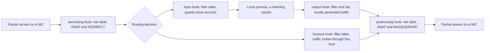

# LFCS Networking (25%)

Networking is 25 percent of the LFCS exam, tied with Operations and Deployment as the largest domain, and it contains the single most reported task family in the whole exam: packet filtering, port redirection and NAT made persistent, named by 7 independent candidate reports. Budget the most practice time here.

The exam is 17 to 20 performance-based tasks in 2 hours with a 67 percent pass mark. Each task names a designated host reached with `ssh <nodename>` from the `base` host, which must never be rebooted. Take root with `sudo -i` and return with `exit`. Nested SSH is not supported.

The only documentation allowed is what the terminal can reach: man pages, `/usr/share/doc`, and the packages shipped with the distribution. There is no browser and no internet, so each recipe names the exact man page to open instead.

Two failure modes decide this domain. The first is a change that works now and disappears at the next boot, so every recipe separates the live effect from the persistence and checks both. The second is a change that locks the host out, which on a networking task can cost the rest of the exam.

<!-- toc -->
## Table of Contents

- [What the exam asks](#what-the-exam-asks)
- [Recipe 1: IPv4 and IPv6 addresses that survive a reboot](#recipe-1-ipv4-and-ipv6-addresses-that-survive-a-reboot)
- [Recipe 2: Hostname and name resolution](#recipe-2-hostname-and-name-resolution)
- [Recipe 3: Time synchronisation and timezone](#recipe-3-time-synchronisation-and-timezone)
- [Recipe 4: Troubleshoot a service unreachable from a peer](#recipe-4-troubleshoot-a-service-unreachable-from-a-peer)
- [Recipe 5: Harden the OpenSSH server and deploy keys](#recipe-5-harden-the-openssh-server-and-deploy-keys)
- [Recipe 6: Packet filtering that survives a reboot](#recipe-6-packet-filtering-that-survives-a-reboot)
- [Recipe 7: Port redirection and NAT](#recipe-7-port-redirection-and-nat)
- [Recipe 8: Static routing](#recipe-8-static-routing)
- [Recipe 9: Bridge and bonding devices](#recipe-9-bridge-and-bonding-devices)
- [Recipe 10: Reverse proxy and load balancer](#recipe-10-reverse-proxy-and-load-balancer)
- [Recipe 11: NFS export and a persistent client mount](#recipe-11-nfs-export-and-a-persistent-client-mount)
- [Ubuntu vs Rocky](#ubuntu-vs-rocky)
- [Quick reference](#quick-reference)
- [Memorise](#memorise)

<!-- toc stop -->

## What the exam asks

| Task type | Sources | Drill |
|---|---|---|
| Packet filtering, port redirection and NAT, made persistent | 7 | Q17, Q18 (planned) |
| NFS export and persistent client mount | 3 | Q21 (planned) |
| sshd hardening, keys and Match blocks | 2 | Q16 (planned) |
| Web server, reverse proxy or load balancer | 2 | Q20 (planned) |
| Static IP, static route, DNS and hosts, then troubleshooting the result | 1 | Q12, Q13, Q14, Q22 (planned) |
| Bridge and bonding devices | 1 | Q19 (planned) |
| Time synchronisation with chrony and timedatectl | 0 reports, named curriculum bullet | Q15 (planned) |



> **Never block ports 8080/tcp, 4505/tcp or 4506/tcp.** The Linux Foundation instructions state this explicitly, for interactive firewall commands and for the distribution's default firewall configuration files alike. Ports 4505 and 4506 are the SaltStack master ports that the grading and orchestration layer uses, so a rule that drops them ends the exam session. Add an explicit accept for all three before setting any default drop policy.

Sources are distinct candidate exam reports counted in `docs/research/2026-09-06-lfcs-exam-research.md`, section 3. A count of 0 means no write-up mentioned it, not that it is safe to skip: time synchronisation is a named curriculum bullet.

## Recipe 1: IPv4 and IPv6 addresses that survive a reboot

**Goal.** A static address on a second interface, with a gateway, on both distribution families, still present after a reboot.

**Frequency.** 1 exam report, "network configuration and troubleshooting" (research section 3, static IP row). Drill: Q12 (planned).

**Commands.**
```bash
ip -br a; ip -j addr show eth1                # overview, then the machine-readable form
ip addr add 192.168.56.10/24 dev eth1; ip link set eth1 up   # runtime only, gone at reboot

# Ubuntu: netplan
cat >/etc/netplan/60-eth1.yaml <<'EOF'
network:
  version: 2
  ethernets:
    eth1:
      dhcp4: false
      addresses: [192.168.56.10/24, "2001:db8:56::10/64"]
      routes:
        - to: default
          via: 192.168.56.1
      nameservers:
        addresses: [1.1.1.1, 9.9.9.9]
        search: [lab.local]
EOF
chmod 600 /etc/netplan/60-eth1.yaml
netplan get                                   # the merged configuration
netplan try                                   # reverts after 120 seconds unless confirmed
netplan apply

# Rocky: NetworkManager
nmcli con show; nmcli dev status
nmcli con mod eth1 ipv4.method manual ipv4.addresses 192.168.56.20/24 \
  ipv4.gateway 192.168.56.1 ipv4.dns "1.1.1.1 9.9.9.9" ipv4.dns-search lab.local
nmcli con mod eth1 ipv6.method manual ipv6.addresses 2001:db8:56::20/64
nmcli con up eth1
```

| Job | Ubuntu 24.04 | Rocky 9 |
|---|---|---|
| Persistent address | `addresses:` in `/etc/netplan/*.yaml` | `nmcli con mod <con> ipv4.addresses` |
| Method | `dhcp4: false` | `ipv4.method manual` |
| Apply safely | `netplan try` then `netplan apply` | `nmcli con up <con>` |
| Stored at | `/etc/netplan/*.yaml` | `/etc/NetworkManager/system-connections/*.nmconnection` |

**Verify.**
```bash
ip -br addr show eth1; ping -c1 192.168.56.1   # live effect

grep -R '192.168.56.' /etc/netplan/           # Ubuntu persistence
nmcli -g ipv4.method,ipv4.addresses con show eth1   # Rocky persistence, expect manual
```
**Gotchas.**
- `ip addr add` is the classic non-persistent answer. A grader that reboots the host sees nothing.
- Netplan YAML uses two-space indent and no tab characters ever. A tab makes `netplan apply` fail with a parser error that names the wrong line.
- `netplan try` reverts automatically if the session dies, which is the safe way to change the interface carrying the SSH session. `netplan apply` does not revert.
- `nmcli` needs `ipv4.method manual`. Setting only `ipv4.addresses` leaves the connection on DHCP and the address is discarded.
- The nmcli connection name and the device name are different things, and `+ipv4.addresses` appends where the bare property replaces the list.

**Docs.** `man 5 netplan`, `man 8 netplan-apply`, `man 8 netplan-try`, `man 1 nmcli`, `man 5 nm-settings-nmcli`, `man 8 ip-address`.

## Recipe 2: Hostname and name resolution

**Goal.** A persistent fully qualified hostname, a static host entry, and DNS servers with a search domain that survive a reboot.

**Frequency.** 1 exam report, and a KodeKloud mock where a DNS change broke `ssh node01` later in the exam (research section 3, static IP row). Drill: Q14 (planned).

**Commands.**
```bash
hostnamectl set-hostname node1.lab.local      # writes /etc/hostname, persistent
hostnamectl status
printf '192.168.56.90\tnode9.lab.local node9\n' >> /etc/hosts

# DNS belongs in the network configuration, not in /etc/resolv.conf
# Ubuntu: the nameservers block of the netplan file, then netplan apply
# Rocky:  nmcli con mod eth1 ipv4.dns "1.1.1.1 9.9.9.9" ipv4.dns-search lab.local

resolvectl status; resolvectl dns; resolvectl query node9
getent hosts node9                            # follows /etc/nsswitch.conf, like a real lookup
dig +short @1.1.1.1 example.com; nslookup example.com; grep '^hosts:' /etc/nsswitch.conf
```
**Verify.**
```bash
hostnamectl --static; hostname -f             # live effect, expect node1.lab.local
getent hosts node9                            # expect 192.168.56.90

cat /etc/hostname                             # persistence of the hostname
resolvectl dns | grep -E '1\.1\.1\.1|9\.9\.9\.9'
grep -R 'nameservers' -A3 /etc/netplan/ || nmcli -g ipv4.dns con show eth1
ls -l /etc/resolv.conf                        # normally a symlink into /run/systemd/resolve
```
**Gotchas.**
- Editing `/etc/resolv.conf` directly is not persistent where `systemd-resolved` owns the file: it is a symlink and it is rewritten. Put the servers in netplan or nmcli.
- `hostname node1` changes the running name only. `hostnamectl set-hostname` writes `/etc/hostname`.
- `getent hosts` respects `nsswitch.conf` order, so it proves what an application would see. `dig` talks to DNS directly and skips `/etc/hosts` entirely.
- Changing the resolver on the host that carries the SSH session can make later tasks fail to resolve the peer name. Test with `getent hosts <peer>` before leaving the host.

**Docs.** `man 1 hostnamectl`, `man 5 hostname`, `man 5 hosts`, `man 5 nsswitch.conf`, `man 1 resolvectl`, `man 5 resolved.conf`, `man 1 dig`.

## Recipe 3: Time synchronisation and timezone

**Goal.** A host that takes time from a named server, serves time to a local subnet, and holds the required timezone across a reboot.

**Frequency.** 0 exam reports, but a named curriculum bullet, "Set and synchronize system time using time servers" (research section 3, time sync row). Drill: Q15 (planned).

**Commands.**
```bash
timedatectl; timedatectl list-timezones | grep -i kolkata
timedatectl set-timezone Asia/Kolkata         # persistent: relinks /etc/localtime
timedatectl set-ntp true

# chrony: config path and unit name differ by family
printf 'server time.google.com iburst\nallow 192.168.56.0/24\n' >> /etc/chrony/chrony.conf   # Ubuntu
printf 'server time.google.com iburst\nallow 192.168.56.0/24\n' >> /etc/chrony.conf          # Rocky
systemctl enable --now chrony                 # Ubuntu unit name
systemctl enable --now chronyd                # Rocky unit name

chronyc sources -v; chronyc tracking; chronyc makestep
```

| Job | Ubuntu 24.04 | Rocky 9 |
|---|---|---|
| chrony config file and unit | `/etc/chrony/chrony.conf`, unit `chrony` | `/etc/chrony.conf`, unit `chronyd` |
| Default sync daemon | `systemd-timesyncd` until chrony is installed | `chronyd` |

**Verify.**
```bash
chronyc sources | grep time.google.com        # live effect
timedatectl show -p Timezone --value          # expect Asia/Kolkata
timedatectl show -p NTPSynchronized --value

systemctl is-enabled chrony 2>/dev/null || systemctl is-enabled chronyd   # persistence
grep -E '^(server|pool|allow)' /etc/chrony/chrony.conf /etc/chrony.conf 2>/dev/null
ls -l /etc/localtime                          # symlink into /usr/share/zoneinfo
```
**Gotchas.**
- `date -s` sets the clock now and fights the daemon, which steps it back. It is never the answer to a time-sync task.
- `allow <subnet>` is what turns the host into an NTP server for clients. Without it chrony only consumes time.
- Serving time needs 123/udp open in the firewall.
- `chrony` and `systemd-timesyncd` conflict. Enabling chrony masks timesyncd on most distributions, but check `timedatectl` for which one is active.
- `iburst` only speeds up the first polls, so `chronyc sources` can still show a question mark straight after a restart.

**Docs.** `man 1 timedatectl`, `man 5 chrony.conf`, `man 1 chronyc`, `man 8 chronyd`, `man 8 systemd-timesyncd.service`.

## Recipe 4: Troubleshoot a service unreachable from a peer

**Goal.** Find why a peer cannot reach a service on this host and fix every cause, typically a bind address and a firewall rule.

**Frequency.** 1 exam report, network configuration and troubleshooting, and the technique behind every firewall task (research section 3, static IP row). Drill: Q22 (planned).

**Commands.**
```bash
ip -br link; ip -br a                         # is the interface up and addressed
ip route; ip route get 10.99.22.2             # is there a path, and out of which NIC
ss -tulpn                                     # what is listening, and on which address
ss -H -ltn 'sport = :8082'
ping -c3 10.99.22.2; tracepath 10.99.22.2
nc -zv 10.99.22.1 8082                        # port reachability, no payload
curl --max-time 3 -sS http://10.99.22.1:8082/
tcpdump -ni any port 8082 -c 20               # do the packets even arrive
nft list ruleset                              # is something dropping them
journalctl -u NetworkManager -b --no-pager | tail; ethtool eth1 | grep Link
```
**Verify.**
```bash
ss -H -ltn | grep ':8082'                     # expect 0.0.0.0:8082 or *:8082, not 127.0.0.1:8082
nft list ruleset | grep -c 8082               # expect no drop rule for the port
curl --max-time 3 -sS http://10.99.22.1:8082/ # live effect, ideally run from the peer
getent hosts node2                            # name resolution still works after the fix
```
**Gotchas.**
- A socket shown as `127.0.0.1:8082` answers only the local host. The service configuration, not the firewall, is the fix.
- A blocked ICMP reply makes `ping` fail on a host whose TCP port is wide open. Test the port, not the host.
- Check the return path as well: a peer can reach the host while the host has no route back.
- `tcpdump -n` avoids reverse DNS lookups, which otherwise stall the capture on a host with a broken resolver.
- Two causes is the common shape of this task. Keep looking after the first fix and confirm end to end from the peer.

**Docs.** `man 8 ss`, `man 8 ip-route`, `man 8 tcpdump`, `man 1 ncat`, `man 8 ethtool`, `man 1 curl`, `man 8 tracepath`.

## Recipe 5: Harden the OpenSSH server and deploy keys

**Goal.** Key-only login with root login disabled, one named user still allowed a password, and the change proven without losing the current session.

**Frequency.** 2 exam reports, including "the Match block is your best friend" (research section 3, sshd row). Drill: Q16 (planned).

**Commands.**
```bash
sshd -T | grep -E '^(permitrootlogin|passwordauthentication|maxauthtries|pubkeyauthentication)'
grep -n '^Include' /etc/ssh/sshd_config       # confirm sshd_config.d is read, and where

printf '%s\n' 'PermitRootLogin no' 'PasswordAuthentication no' 'MaxAuthTries 3' \
  'PubkeyAuthentication yes' 'AllowUsers deploy ops' > /etc/ssh/sshd_config.d/90-hardening.conf

# A Match block applies to everything after it, so it must come last
printf '%s\n' 'Match User deploy' '    PasswordAuthentication yes' \
  > /etc/ssh/sshd_config.d/99-match-deploy.conf

sshd -t                                       # syntax check, always before a restart
systemctl reload ssh                          # Ubuntu unit; sshd on Rocky

ssh-keygen -t ed25519 -f /root/.ssh/id_deploy -N ''
ssh-copy-id -i /root/.ssh/id_deploy.pub deploy@node2
install -d -m 700 -o deploy -g deploy /home/deploy/.ssh
install -m 600 -o deploy -g deploy /dev/null /home/deploy/.ssh/authorized_keys

ssh -L 8443:127.0.0.1:443 node2; ssh -R 9000:127.0.0.1:9000 node2   # local and remote forwards
```
**Verify.**
```bash
sshd -T | grep -E 'permitrootlogin no|passwordauthentication no|maxauthtries 3'
sshd -T -C user=deploy,host=node1,addr=127.0.0.1 | grep passwordauthentication   # expect yes
ssh -i /root/.ssh/id_deploy -o BatchMode=yes deploy@localhost true && echo key-login-ok

stat -c '%a %U %G' /home/deploy/.ssh/authorized_keys   # expect 600 deploy deploy
systemctl is-enabled ssh 2>/dev/null || systemctl is-enabled sshd   # persistence
```
**Gotchas.**
- `sshd -T` prints the effective configuration and is the only honest check. Reading the file misses `Include` files and defaults.
- OpenSSH takes the first occurrence of a keyword, so a drop-in only wins when its `Include` line comes before the setting in the main file. Ubuntu ships that `Include` at the top; on Rocky check that it is there before relying on `sshd_config.d`.
- `authorized_keys` must be mode 600 and owned by the user, and the home directory must not be group writable, or sshd ignores the key without saying so.
- Never restart sshd without a second working session open and `sshd -t` clean. A syntax error with no running daemon is unrecoverable over the network.
- Recent Ubuntu uses socket activation, so `systemctl restart ssh` may not rebind the port. `systemctl restart ssh.socket` does.

**Docs.** `man 5 sshd_config`, `man 8 sshd`, `man 5 ssh_config`, `man 1 ssh`, `man 1 ssh-keygen`, `man 1 ssh-copy-id`.

## Recipe 6: Packet filtering that survives a reboot

**Goal.** A host that accepts only the required services, drops everything else, and comes back after a reboot with exactly the same ruleset.

**Frequency.** 7 exam reports, the most reported task family in the exam (research section 3, packet filtering row). Drill: Q17 (planned).

**Warning.** Never block 8080/tcp, 4505/tcp or 4506/tcp. Accept them explicitly before setting any default drop policy, and check the saved file as well as the live ruleset.

**Commands.**
```bash
nft list ruleset                              # always read before writing
nft add table inet filter
nft add chain inet filter input '{ type filter hook input priority 0 ; policy accept ; }'

# Accept rules first, policy drop last. The reverse order locks the session out.
nft add rule inet filter input ct state established,related accept
nft add rule inet filter input iif lo accept
nft add rule inet filter input ip protocol icmp accept
nft add rule inet filter input tcp dport { 22, 80, 443 } accept
nft add rule inet filter input tcp dport { 8080, 4505, 4506 } accept   # exam grader ports
nft chain inet filter input '{ policy drop ; }'

# ufw, the Ubuntu front end
ufw allow 22/tcp; ufw allow 80,443/tcp; ufw allow 8080,4505,4506/tcp
ufw default deny incoming; ufw --force enable
ufw status numbered; ufw delete 3

# firewalld, the Rocky front end
firewall-cmd --get-active-zones
firewall-cmd --permanent --add-service=ssh --add-service=http --add-service=https
firewall-cmd --permanent --add-port=8080/tcp --add-port=4505/tcp --add-port=4506/tcp
firewall-cmd --reload

# iptables, still accepted by graders and usually the nft backend underneath
iptables -S
iptables -I INPUT 1 -p tcp -m multiport --dports 22,8080,4505,4506 -j ACCEPT
iptables -A INPUT -m conntrack --ctstate ESTABLISHED,RELATED -j ACCEPT; iptables -P INPUT DROP

# Persist: the file AND the enabled service, both halves
nft list ruleset > /etc/nftables.conf ; systemctl enable --now nftables          # Ubuntu
nft list ruleset > /etc/sysconfig/nftables.conf ; systemctl enable --now nftables # Rocky
netfilter-persistent save                                                        # Ubuntu iptables
iptables-save > /etc/sysconfig/iptables                                          # Rocky iptables
```

| Persistence | Ubuntu 24.04 | Rocky 9 |
|---|---|---|
| Front end | `ufw` | `firewall-cmd` |
| Front end persists by | `ufw enable`, rules in `/etc/ufw/*.rules` | `--permanent` then `firewall-cmd --reload` |
| nftables ruleset file | `/etc/nftables.conf` | `/etc/sysconfig/nftables.conf` |
| nftables at boot | `systemctl enable nftables` | `systemctl enable nftables` |
| iptables save file | `/etc/iptables/rules.v4` via `netfilter-persistent save` | `/etc/sysconfig/iptables` via `iptables-save >` |

**Verify.**
```bash
nft list ruleset; ss -H -ltn                             # live effect, and what still listens
# from the peer host: the allowed port answers, the denied port does not
curl --max-time 3 -s http://10.99.17.1:80/ >/dev/null && echo 80-open
curl --max-time 3 -s http://10.99.17.1:9999/ >/dev/null || echo 9999-closed

grep -cE 'dport|accept' /etc/nftables.conf 2>/dev/null   # persistence of the rules
systemctl is-enabled nftables                            # the file alone does nothing
ufw status verbose 2>/dev/null; firewall-cmd --permanent --list-all 2>/dev/null
for p in 8080 4505 4506; do nft list ruleset | grep -q "$p" && echo "$p referenced"; done
```
**Gotchas.**
- Ports 8080, 4505 and 4506 must stay reachable. Check the saved file too, because a persisted default-drop policy blocks them on the next boot even if the live ruleset was fine.
- Set the accept rules before the drop policy. `nft chain ... '{ policy drop ; }'` applied first cuts the SSH session immediately.
- `nft flush ruleset` deletes the rules ufw and firewalld installed as well, because both front ends drive nftables underneath. Mixing raw `nft` with either one works only until the front end reloads. Choose one tool per host.
- `iptables -V` usually reports `nf_tables`, so `iptables` commands become nftables rules in a separate table: read both `iptables -S` and `nft list ruleset`. `-I` inserts at the top, `-A` appends, and an accept appended after a drop never matches.
- A rule added with `nft add` is gone at the next boot unless the ruleset is written to the distribution file and the `nftables` service is enabled. Check `systemctl is-enabled nftables`, not just the file.

**Docs.** `man 8 nft` for the table, chain, hook and priority syntax, `man 8 ufw`, `man 1 firewall-cmd`, `man 5 firewalld.zone`, `man 8 iptables`, `man 8 iptables-save`, `man 8 netfilter-persistent`.

## Recipe 7: Port redirection and NAT

**Goal.** Traffic arriving on one port served by a process listening on another, plus a private subnet reaching the outside through this host, both persistent.

**Frequency.** 7 exam reports, the same family as recipe 6, with `iptables -t nat -A PREROUTING ... -j REDIRECT --to-port` quoted verbatim by one candidate (research section 3, packet filtering row). Drill: Q18 (planned).

**Warning.** A redirect from 8080 or a rule that drops 8080, 4505 or 4506 ends the exam session. Redirecting other ports to 8080 is fine; blocking or hijacking those three is not.

**Commands.**
```bash
# Forwarding first, and persistently, or masquerade silently does nothing
sysctl -w net.ipv4.ip_forward=1
echo 'net.ipv4.ip_forward = 1' > /etc/sysctl.d/90-forward.conf
sysctl --system

nft add table ip nat
nft add chain ip nat prerouting '{ type nat hook prerouting priority dstnat ; }'
nft add chain ip nat postrouting '{ type nat hook postrouting priority srcnat ; }'
nft add rule ip nat prerouting tcp dport 8081 redirect to :8080
nft add rule ip nat prerouting iif eth1 tcp dport 80 dnat to 10.99.18.5:8080
nft add rule ip nat postrouting ip saddr 10.99.18.0/24 oif eth0 masquerade

# iptables equivalents, accepted by graders that check behaviour
iptables -t nat -A PREROUTING -p tcp --dport 8081 -j REDIRECT --to-port 8080
iptables -t nat -A PREROUTING -i eth1 -p tcp --dport 80 -j DNAT --to-destination 10.99.18.5:8080
iptables -t nat -A POSTROUTING -s 10.99.18.0/24 -o eth0 -j MASQUERADE

# firewalld
firewall-cmd --permanent --add-forward-port=port=8081:proto=tcp:toport=8080
firewall-cmd --permanent --add-masquerade
firewall-cmd --reload

# Persist the nftables version
nft list ruleset > /etc/nftables.conf ; systemctl enable --now nftables
```

| Job | Ubuntu 24.04 | Rocky 9 |
|---|---|---|
| Redirect a port | `nft ... redirect to :8080` saved to `/etc/nftables.conf` | `firewall-cmd --permanent --add-forward-port=...` |
| Masquerade | `nft ... masquerade`, saved the same way | `firewall-cmd --permanent --add-masquerade` |

**Verify.**
```bash
nft list ruleset | grep -E 'redirect|dnat|masquerade'   # live effect
iptables -t nat -S | grep -E 'REDIRECT|DNAT|MASQUERADE'
curl --max-time 3 -s http://10.99.18.1:8081/            # from the peer, returns the 8080 page
sysctl -n net.ipv4.ip_forward                           # expect 1

grep -E 'redirect|masquerade' /etc/nftables.conf        # persistence of the rules
grep -r ip_forward /etc/sysctl.d/                       # persistence of forwarding
systemctl is-enabled nftables; firewall-cmd --permanent --list-forward-ports 2>/dev/null
```
**Gotchas.**
- `sysctl -w net.ipv4.ip_forward=1` is runtime only. The drop-in under `/etc/sysctl.d` is the half that survives the reboot, and a NAT task is graded on both.
- The prerouting hook never sees locally generated traffic. Testing a redirect with `curl localhost:8081` on the same host fails even when the rule is correct; test from the peer, or add an output chain rule.
- `nat` chains need a priority. Use the named values `dstnat` for prerouting and `srcnat` for postrouting.
- The nat table is consulted only for the first packet of a connection. After changing a rule, flush conntrack with `conntrack -F` before retesting or the old translation persists.
- `REDIRECT` sends traffic to a port on this host; `DNAT` sends it to another host. Both, and masquerade, need forwarding on and a filter forward chain that accepts, or no packet moves.

**Docs.** `man 8 nft`, `man 8 iptables`, `man 8 iptables-extensions` for `REDIRECT`, `DNAT` and `MASQUERADE`, `man 1 firewall-cmd`, `man 5 sysctl.d`, `man 8 conntrack`.

## Recipe 8: Static routing

**Goal.** A route to a remote network through a specific gateway and interface, present now and after a reboot.

**Frequency.** 1 exam report, and a KodeKloud mock that removes routes and expects `netplan try` (research section 3, static IP row). Drill: Q13 (planned).

**Commands.**
```bash
ip route
ip -j route                                   # machine readable
ip route get 10.200.0.5                       # which route would actually be used
ip route add 10.200.0.0/16 via 192.168.56.1 dev eth1    # runtime only
ip route del 10.200.0.0/16

# Ubuntu: a routes block in the netplan file for eth1, then netplan try
#   routes:
#     - to: 10.200.0.0/16
#       via: 192.168.56.1

# Rocky: append to the connection, then bring it up
nmcli con mod eth1 +ipv4.routes "10.200.0.0/16 192.168.56.1"
nmcli con up eth1
```

| Job | Ubuntu 24.04 | Rocky 9 |
|---|---|---|
| Persistent static route | `routes:` list in `/etc/netplan/*.yaml` | `nmcli con mod <con> +ipv4.routes "<cidr> <gw>"` |
| Default route | `- to: default` with `via:` | `ipv4.gateway`, or a `0.0.0.0/0` route |

**Verify.**
```bash
ip -j route | grep 10.200.0.0/16               # live effect
ip route get 10.200.0.5                        # expect via 192.168.56.1 dev eth1

grep -A3 'routes' /etc/netplan/*.yaml          # Ubuntu persistence
nmcli -g ipv4.routes con show eth1             # Rocky persistence
```
**Gotchas.**
- A route added with `ip route add` is gone at the next boot. Only the netplan file or the nmcli connection persists it.
- The gateway must already be reachable on a directly connected subnet, otherwise the kernel rejects the route with "Nexthop has invalid gateway".
- Netplan's `gateway4:` key is deprecated and ignored on recent releases. Write `- to: default` inside `routes:` instead.
- `+ipv4.routes` appends; plain `ipv4.routes` replaces the whole list and can drop the default route.

**Docs.** `man 8 ip-route`, `man 5 netplan`, `man 1 nmcli`, `man 5 nm-settings-nmcli`.

## Recipe 9: Bridge and bonding devices

**Goal.** A bridge that carries the address previously held by a physical NIC, and a bond of two NICs in active-backup mode, both persistent.

**Frequency.** 1 exam report, plus a KodeKloud mock task that adds eth1 to a bridge (research section 3, bridge row). Drill: Q19 (planned).

**Commands.**
```bash
# Ubuntu: netplan
cat >/etc/netplan/70-br0.yaml <<'EOF'
network:
  version: 2
  ethernets:
    eth1: {dhcp4: false}
    eth2: {dhcp4: false}
    eth3: {dhcp4: false}
  bridges:
    br0:
      interfaces: [eth1]
      addresses: [192.168.56.10/24]
      parameters: {stp: false, forward-delay: 0}
  bonds:
    bond0:
      interfaces: [eth2, eth3]
      parameters: {mode: active-backup, primary: eth2, mii-monitor-interval: 100}
EOF
netplan try

# Rocky: NetworkManager
nmcli con add type bridge con-name br0 ifname br0 ipv4.method manual ipv4.addresses 192.168.56.20/24
nmcli con add type ethernet slave-type bridge con-name br0-eth1 ifname eth1 master br0
nmcli con add type bond con-name bond0 ifname bond0 bond.options "mode=active-backup,miimon=100"
nmcli con add type ethernet slave-type bond con-name bond0-eth2 ifname eth2 master bond0; nmcli con up br0
```

| Job | Ubuntu 24.04 | Rocky 9 |
|---|---|---|
| Create a bridge | `bridges:` block in netplan | `nmcli con add type bridge` |
| Attach a member | `interfaces: [eth1]` | `nmcli con add type ethernet slave-type bridge master br0` |
| Create a bond | `bonds:` with `mode: active-backup` | `nmcli con add type bond bond.options "mode=active-backup,miimon=100"` |

**Verify.**
```bash
ip -br link show br0; ip -br addr show br0      # live effect: state UP, address on the bridge
bridge link                                    # members and their master
head -12 /proc/net/bonding/bond0               # active slave and link status

grep -R 'br0' /etc/netplan/                    # Ubuntu persistence
nmcli -g connection.type,connection.slave-type con show br0-eth1   # Rocky persistence
```
**Gotchas.**
- A bridge member cannot keep its own IP address. Move the address to the bridge in the same change, or the host loses connectivity the moment the member is enslaved.
- Do this on a NIC that is not carrying the SSH session, or use `netplan try` so a mistake reverts by itself.
- `ip link` alone does not show which bridge a NIC belongs to; `bridge link` and `ip -d link show eth1` do. With STP enabled a new port takes around 30 seconds to start forwarding, so an immediate test can fail on a correct configuration.
- Bond modes have both names and numbers. `active-backup` and `1` are the same thing, and `miimon` must be set or link failures go undetected.

**Docs.** `man 5 netplan`, `man 8 bridge`, `man 8 ip-link` for `type bridge` and `type bond`, `man 1 nmcli`, `man 5 nm-settings-nmcli`.

## Recipe 10: Reverse proxy and load balancer

**Goal.** A public listener on port 80 that forwards to one or more application backends, enabled at boot, working with the host security policy.

**Frequency.** 2 exam reports, web server and proxy tasks (research section 3, web server row). Drill: Q20 (planned).

**Commands.**
```bash
cat >/etc/nginx/conf.d/app.conf <<'EOF'
upstream app_pool {
    server 127.0.0.1:9000;
    server 127.0.0.1:9001 backup;
}

server {
    listen 80;
    server_name _;

    location / {
        proxy_pass http://app_pool;
        proxy_set_header Host $host;
        proxy_set_header X-Real-IP $remote_addr;
        proxy_set_header X-Forwarded-For $proxy_add_x_forwarded_for;
    }
}
EOF
rm -f /etc/nginx/sites-enabled/default        # Ubuntu default site otherwise owns port 80
nginx -t                                      # always before a reload
systemctl enable --now nginx
systemctl reload nginx

setsebool -P httpd_can_network_connect on     # Rocky: SELinux blocks outbound proxying by default

# haproxy alternative: a frontend with "bind :80" and "default_backend be_app", then a
# backend with "balance roundrobin" and one "server appN 127.0.0.1:900N check" line each
haproxy -c -f /etc/haproxy/haproxy.cfg        # config check, like nginx -t
systemctl enable --now haproxy
```
**Verify.**
```bash
curl -sS http://localhost/                    # live effect, expect the backend response
nginx -t; ss -H -ltn | grep ':80 '; grep -R 'proxy_pass' /etc/nginx/

systemctl is-enabled nginx                    # persistence
getsebool httpd_can_network_connect 2>/dev/null   # Rocky, expect on
```
**Gotchas.**
- On Rocky an unset `httpd_can_network_connect` gives a 502 with a perfectly correct nginx configuration. It is the single most common silent failure in this recipe.
- `proxy_pass http://backend;` passes the URI through unchanged; `proxy_pass http://backend/;` with the trailing slash strips the matched location prefix. The two behave differently and the task usually cares.
- Ubuntu's packaged default site listens on port 80 and answers first. Remove the symlink in `sites-enabled` or the proxy never sees a request.
- `systemctl reload` keeps existing connections, `restart` drops them. Neither survives a reboot without `systemctl enable`.
- The firewall still applies: a working proxy on the loopback interface proves nothing about reachability from a peer. Most backends also need `proxy_set_header Host $host` to route correctly.

**Docs.** `man 8 nginx`, `/usr/share/doc/nginx` for the packaged example configuration, `man 1 haproxy`, `/usr/share/doc/haproxy/configuration.txt.gz`, `man 8 setsebool`.

## Recipe 11: NFS export and a persistent client mount

**Goal.** A directory exported to a network with the exact permissions the task words, mounted on the client at boot without hanging the boot.

**Frequency.** 3 exam reports, with one candidate stressing that the `ro` or `rw` word decides the grade (research section 3, NFS row). Drill: Q21 (planned).

**Commands.**
```bash
# Server
mkdir -p /srv/share && echo marker > /srv/share/marker
echo '/srv/share 10.0.0.0/8(rw,sync,no_subtree_check,no_root_squash)' >> /etc/exports
exportfs -ra                                  # re-export everything after every edit
exportfs -v
systemctl enable --now nfs-kernel-server      # Ubuntu; nfs-server on Rocky
firewall-cmd --permanent --add-service=nfs --add-service=rpc-bind --add-service=mountd
firewall-cmd --reload

# Client
showmount -e 192.168.56.10; mkdir -p /mnt/share
mount -t nfs 192.168.56.10:/srv/share /mnt/share        # runtime only
echo '192.168.56.10:/srv/share /mnt/share nfs defaults,_netdev 0 0' >> /etc/fstab
systemctl daemon-reload; mount -a; findmnt --verify
```
**Verify.**
```bash
exportfs -v | grep /srv/share                 # server side, check rw or ro and root squashing
findmnt -no FSTYPE,SOURCE /mnt/share          # live effect, expect nfs4 and the server path
cat /mnt/share/marker

grep /mnt/share /etc/fstab                    # persistence
findmnt --verify                              # the fstab line is valid
umount /mnt/share && mount -a && findmnt /mnt/share   # proves the fstab line really mounts
```
**Gotchas.**
- `ro` against `rw`, and `root_squash` against `no_root_squash`, are single words that decide the grade. Re-read the task before leaving the host.
- A space between the network and the opening parenthesis in `/etc/exports` exports the share to the whole world with default options. It is silent and it is wrong.
- `_netdev` tells systemd the mount needs the network. Without it a boot can hang for a minute and a half waiting for an unreachable server. `x-systemd.automount` defers the mount until first access, which is safer still.
- The server unit is `nfs-kernel-server` on Ubuntu and `nfs-server` on Rocky, from packages `nfs-kernel-server` and `nfs-utils`.
- NFSv4 needs only 2049/tcp. NFSv3 also needs 111 and the mountd and statd ports, which is why the firewalld services exist as a set.

**Docs.** `man 5 exports`, `man 8 exportfs`, `man 5 nfs` for the mount options, `man 8 mount.nfs`, `man 5 fstab`, `man 8 showmount`, `man 5 systemd.mount`.

## Ubuntu vs Rocky

| Job | Ubuntu 24.04 | Rocky 9 |
|---|---|---|
| Persistent address | `/etc/netplan/*.yaml` then `netplan apply` | `nmcli con mod <con> ipv4.method manual ipv4.addresses` |
| Persistent route | netplan `routes:` list | `nmcli con mod <con> +ipv4.routes "<cidr> <gw>"` |
| DNS servers | netplan `nameservers:` | `nmcli con mod <con> ipv4.dns` |
| Safe apply | `netplan try` | `nmcli con up <con>` |
| Firewall front end | `ufw` | `firewall-cmd` |
| nftables ruleset file | `/etc/nftables.conf` | `/etc/sysconfig/nftables.conf` |
| iptables save file | `/etc/iptables/rules.v4`, `netfilter-persistent save` | `/etc/sysconfig/iptables`, `iptables-save >` |
| SSH unit | `ssh`, plus `ssh.socket` on 24.04 | `sshd` |
| chrony file and unit | `/etc/chrony/chrony.conf`, `chrony` | `/etc/chrony.conf`, `chronyd` |
| NFS server package and unit | `nfs-kernel-server` | `nfs-utils`, unit `nfs-server` |
| MAC to check after a proxy task | AppArmor profile for nginx | `setsebool -P httpd_can_network_connect on` |

## Quick reference

```bash
ip -br a; ip -br link; ip -j route; ip route get 10.200.0.5; ss -tulpn
netplan try; netplan apply; nmcli con mod eth1 ipv4.method manual ipv4.addresses 192.168.56.20/24; nmcli con up eth1
nmcli con mod eth1 +ipv4.routes "10.200.0.0/16 192.168.56.1"
hostnamectl set-hostname node1.lab.local; getent hosts node9; resolvectl dns
timedatectl set-timezone Asia/Kolkata; chronyc sources -v; chronyc tracking
sshd -T | grep permitrootlogin; sshd -T -C user=deploy,addr=127.0.0.1 | grep passwordauth; sshd -t
nft list ruleset
nft add chain inet filter input '{ type filter hook input priority 0 ; policy drop ; }'
nft add rule inet filter input tcp dport { 22, 80, 443, 8080, 4505, 4506 } accept
nft add rule ip nat prerouting tcp dport 8081 redirect to :8080
nft add rule ip nat postrouting ip saddr 10.99.18.0/24 oif eth0 masquerade
nft list ruleset > /etc/nftables.conf; systemctl enable --now nftables
iptables -t nat -A PREROUTING -p tcp --dport 8081 -j REDIRECT --to-port 8080
iptables -t nat -A POSTROUTING -s 10.99.18.0/24 -o eth0 -j MASQUERADE
ufw allow 22/tcp; ufw default deny incoming; ufw --force enable; ufw status numbered
firewall-cmd --permanent --add-service=http; firewall-cmd --permanent --add-port=8080/tcp; firewall-cmd --reload
echo 'net.ipv4.ip_forward = 1' >/etc/sysctl.d/90-forward.conf; sysctl --system
bridge link; cat /proc/net/bonding/bond0; nmcli con add type bridge con-name br0 ifname br0
nginx -t; systemctl reload nginx; setsebool -P httpd_can_network_connect on
exportfs -ra; exportfs -v; showmount -e SERVER; mount -a; findmnt --verify
tcpdump -ni any port 8082 -c 20; nc -zv HOST PORT; curl --max-time 3 -sS http://HOST:PORT/
```

## Memorise

- **Never block 8080/tcp, 4505/tcp or 4506/tcp**, in a live command or in a persisted configuration file. Accept all three explicitly before any default drop policy. Blocking them ends the exam session.
- Accept rules first, `policy drop` last. Reversing that order cuts the SSH session on the spot.
- Persistence is a pair, never a single step: `nft list ruleset > /etc/nftables.conf` on Ubuntu or `/etc/sysconfig/nftables.conf` on Rocky, **and** `systemctl enable nftables`.
- `ip addr add`, `ip route add`, `sysctl -w` and a bare `mount` are all runtime only. The persistent forms are a netplan file or an nmcli connection, `/etc/sysctl.d`, and `/etc/fstab`.
- `netplan try` reverts by itself after 120 seconds; `netplan apply` does not. Use `try` on the interface carrying the session.
- `nmcli` needs `ipv4.method manual` or the address is ignored, and `+ipv4.routes` appends where the bare property replaces.
- Netplan YAML: two-space indent, no tabs, file mode 600.
- `sshd -T` prints the effective configuration; `sshd -T -C user=deploy,addr=127.0.0.1` proves a `Match` block. `Match` goes last, and `sshd -t` runs before every restart.
- `authorized_keys` is mode 600, owned by the user, in a 700 `.ssh` directory, in a home directory that is not group writable.
- Redirect is `nft ... redirect to :8080` or `iptables -t nat -A PREROUTING -p tcp --dport 8081 -j REDIRECT --to-port 8080`. Masquerade needs `net.ipv4.ip_forward=1` persisted and a forward chain that accepts.
- The prerouting hook never sees locally generated traffic, so test a redirect from the peer, not with `curl localhost`.
- `nat` chain priorities are `dstnat` for prerouting and `srcnat` for postrouting; flush conntrack after changing a nat rule.
- A bridge member holds no address; move the address to `br0` in the same change.
- On Rocky a reverse proxy needs `setsebool -P httpd_can_network_connect on`, and on Ubuntu the packaged default site must be removed from `sites-enabled`.
- In `/etc/exports` there is no space before the parenthesis, `exportfs -ra` follows every edit, and `_netdev` on the client fstab line stops the boot from hanging.
- `ro` against `rw`, and `root_squash` against `no_root_squash`: one word decides the grade.
- A socket on `127.0.0.1` is not a firewall problem. Read `ss -tulpn` before touching `nft`.
- Leave firewall and network tasks until the end of the exam, and confirm `ssh` still works from `base` before moving on.
