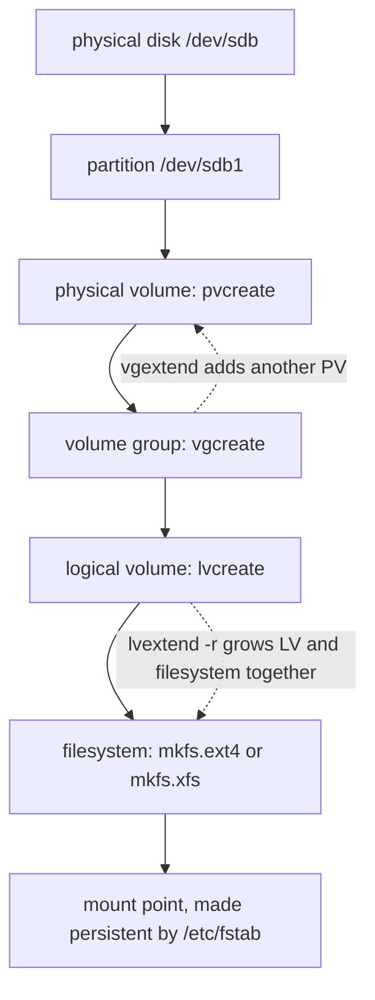

# LFCS Study Notes — Storage (20%)

Storage is where the exam is most mechanical and least forgiving. Almost every task here changes something that must survive a reboot, and the marks go to the `/etc/fstab` or `/etc/crypttab` line, not to the `mount` command that worked in front of you.

<!-- toc -->
## Table of Contents

- [What the exam asks](#what-the-exam-asks)
- [Recipe 1: Partition a disk and make a filesystem](#recipe-1-partition-a-disk-and-make-a-filesystem)
- [Recipe 2: Mount it persistently, by UUID](#recipe-2-mount-it-persistently-by-uuid)
- [Recipe 3: Build LVM from scratch](#recipe-3-build-lvm-from-scratch)
- [Recipe 4: Extend a mounted logical volume online](#recipe-4-extend-a-mounted-logical-volume-online)
- [Recipe 5: Add swap that survives a reboot](#recipe-5-add-swap-that-survives-a-reboot)
- [Recipe 6: Export over NFS and mount it persistently](#recipe-6-export-over-nfs-and-mount-it-persistently)
- [Recipe 7: Attach a network block device](#recipe-7-attach-a-network-block-device)
- [Recipe 8: Mirror two disks with mdadm, and quotas](#recipe-8-mirror-two-disks-with-mdadm-and-quotas)
- [Recipe 9: Encrypt a volume with LUKS, and triage a full filesystem](#recipe-9-encrypt-a-volume-with-luks-and-triage-a-full-filesystem)
- [Ubuntu vs Rocky](#ubuntu-vs-rocky)
- [Quick reference](#quick-reference)
- [Memorise](#memorise)

<!-- toc stop -->

## What the exam asks

| Task type | Sources | Drill |
|---|---|---|
| LVM: create a volume group and a logical volume, or extend one that is mounted | 4 | Q24, Q25 |
| Partition a disk, make a filesystem, mount it persistently by UUID | 2 | Q23 |
| NFS export and a persistent client mount | 3 | Q21 |
| Swap file or swap partition, persistent | 1 | Q26 |
| RAID 1 with mdadm | 1 | Q28 |
| Network block device | mock reports only | Q30 |
| Quotas | curriculum bullet | Q27 |
| Encrypted volume with LUKS | curriculum bullet | Q29 |
| A filesystem is full: find and reclaim | 2 | Q31 |

The curriculum bullets this covers: configure and manage LVM storage; manage and configure the virtual file system; create, manage and troubleshoot filesystems; use remote filesystems and network block devices; configure and manage swap space; configure filesystem automounters; monitor storage performance.



---

## Recipe 1: Partition a disk and make a filesystem

**Goal.** A new disk carries one partition with a labelled filesystem, ready to mount.

**Frequency.** 2 candidate sources report partition and format tasks, usually combined with a persistent mount. Drill: Q23.

**Commands.**

```bash
lsblk -f                                  # find the empty disk; note its name
wipefs -a /dev/sdb                        # only on a disk you are certain is spare

parted -s /dev/sdb mklabel gpt
parted -s /dev/sdb mkpart primary ext4 1MiB 100%
partprobe /dev/sdb                        # make the kernel re-read the table

mkfs.ext4 -L data /dev/sdb1               # or: mkfs.xfs -L data /dev/sdb1
```

**Verify.**

```bash
lsblk -f /dev/sdb
blkid -s TYPE -o value /dev/sdb1          # ext4
blkid -s LABEL -o value /dev/sdb1         # data
```

**Gotchas.**

- Confirm the disk is genuinely spare before touching it. `lsblk -f` showing no filesystem and no mount point is the check. Partitioning the wrong disk is unrecoverable in an exam.
- `parted` starting at `1MiB` rather than sector 1 keeps the partition aligned. Misalignment is a performance problem, not an exam failure, but the habit is free.
- After `parted`, the kernel may still hold the old table. `partprobe` or `partx -u` fixes it; without it `mkfs` may fail with "device is busy".
- `mkfs` on the whole disk rather than the partition also works, and some tasks ask for exactly that. Read which one is wanted.

**Docs.** `man 8 parted`, `man 8 mkfs.ext4`, `man 8 lsblk`, `man 8 blkid`.

---

## Recipe 2: Mount it persistently, by UUID

**Goal.** The filesystem is mounted at the requested path with the requested options, and it comes back after a reboot.

**Frequency.** Appears in every storage task that creates a filesystem. One KodeKloud mock originally graded only the device name and was corrected in 2026 to accept a UUID, which is the form the exam actually teaches. Drill: Q23.

**Commands.**

```bash
mkdir -p /data
blkid -s UUID -o value /dev/sdb1          # copy this value

cat >> /etc/fstab <<'EOF'
UUID=<the-uuid-you-just-read>  /data  ext4  defaults,noatime  0  2
EOF

findmnt --verify                          # parse and sanity-check fstab
mount -a                                  # mount everything not yet mounted
```

**Verify.**

```bash
findmnt -no SOURCE,TARGET,FSTYPE,OPTIONS /data
findmnt --verify --verbose | tail -5
grep /data /etc/fstab
```

**Gotchas.**

- **`findmnt --verify` before you reboot.** A malformed fstab line can leave the machine unbootable, and recovering from that is itself a curriculum bullet, not something you want to discover by accident.
- Use `UUID=` rather than `/dev/sdb1`. Device names are not stable across reboots when disks are added.
- The sixth field is the fsck pass: `1` for the root filesystem, `2` for others, `0` to skip. `0` on a data filesystem is accepted but not the convention.
- `mount -a` is the test that the line works. If it errors, fix it now rather than after the reboot.
- Add `nofail` when a mount is not essential to boot, such as an NFS or USB mount. It turns an unbootable machine into a missing directory.

**Docs.** `man 5 fstab`, `man 8 findmnt`, `man 8 mount`.

---

## Recipe 3: Build LVM from scratch

**Goal.** A volume group across one or more disks, carrying a logical volume of a stated size, formatted and mounted persistently.

**Frequency.** 4 candidate sources, the joint most reported storage family. Drill: Q24.

**Commands.**

```bash
pvcreate /dev/sdb /dev/sdc                # whole disks or partitions, both work
vgcreate -s 16M vg_data /dev/sdb /dev/sdc # -s sets the extent size when asked
lvcreate -L 1.5G -n lv_app vg_data        # or -l 100%FREE for everything

mkfs.ext4 /dev/vg_data/lv_app
mkdir -p /app
echo "/dev/vg_data/lv_app  /app  ext4  defaults  0  2" >> /etc/fstab
mount -a
```

**Verify.**

```bash
pvs -o pv_name,vg_name
vgs --noheadings -o vg_name,vg_extent_size vg_data
lvs --noheadings -o lv_name,lv_size vg_data
findmnt -no SOURCE,TARGET /app
```

**Gotchas.**

- `-s 16M` on `vgcreate` sets the extent size. Tasks that specify one are testing whether you know the flag; the default is 4M.
- Sizes: `-L` is absolute (`1.5G`), `-l` is in extents or a percentage (`-l 100%FREE`, `-l 50%VG`). Reading `-L` when the task said percent costs the mark.
- The device path is `/dev/<vg>/<lv>` or `/dev/mapper/<vg>-<lv>`. Both work in fstab.
- LVM device names are stable, so a UUID is not required here, though it is still accepted.

**Docs.** `man 8 lvm`, `man 8 pvcreate`, `man 8 vgcreate`, `man 8 lvcreate`.

---

## Recipe 4: Extend a mounted logical volume online

**Goal.** A logical volume that is in use grows, and its filesystem grows with it, without unmounting.

**Frequency.** 4 candidate sources, and the single most likely LVM task. One candidate specifically calls out online resizing. Drill: Q25.

**Commands.**

```bash
vgs vg_data                               # is there free space in the group?

# If not, add a disk first:
pvcreate /dev/sdd
vgextend vg_data /dev/sdd

lvextend -r -L +400M /dev/vg_data/lv_app  # -r grows the filesystem too
```

Without `-r`, grow the filesystem yourself, and note that the two filesystems use different commands:

```bash
resize2fs /dev/vg_data/lv_app             # ext2, ext3, ext4
xfs_growfs /app                           # XFS takes the MOUNT POINT, not the device
```

**Verify.**

```bash
lvs --noheadings -o lv_name,lv_size vg_data
df -hT /app                               # the filesystem, not just the volume
findmnt -no TARGET /app                   # still mounted throughout
```

**Gotchas.**

- **`-r` is the whole trick.** It calls the right resize tool for the filesystem. Growing the LV without it leaves the filesystem the old size, which looks correct in `lvs` and wrong in `df`. Always check `df`, not `lvs`.
- `+400M` adds; `400M` sets the total. Confusing them shrinks the volume, and shrinking a mounted ext4 fails while shrinking XFS is impossible at any time.
- **XFS cannot shrink, ever.** If a task asks you to shrink, the filesystem is ext4 or the task means something else.
- `xfs_growfs` takes the mount point. `resize2fs` takes the device. This asymmetry is a classic exam trip.

**Docs.** `man 8 lvextend`, `man 8 resize2fs`, `man 8 xfs_growfs`.

---

## Recipe 5: Add swap that survives a reboot

**Goal.** Additional swap of a stated size, at a stated priority, active now and after a reboot.

**Frequency.** 1 candidate source names swap directly, and it is an explicit curriculum bullet. Drill: Q26.

**Commands.**

```bash
fallocate -l 512M /swapfile2              # or: dd if=/dev/zero of=/swapfile2 bs=1M count=512
chmod 600 /swapfile2                      # mkswap refuses anything more permissive
mkswap /swapfile2
swapon -p 10 /swapfile2

echo "/swapfile2  none  swap  sw,pri=10  0  0" >> /etc/fstab
```

For a swap partition instead of a file:

```bash
mkswap /dev/sdb2
swapon /dev/sdb2
echo "UUID=$(blkid -s UUID -o value /dev/sdb2)  none  swap  sw  0  0" >> /etc/fstab
```

**Verify.**

```bash
swapon --show
free -h | grep -i swap
stat -c '%a' /swapfile2                   # 600
grep swap /etc/fstab
```

**Gotchas.**

- `chmod 600` before `mkswap`. A world-readable swap file is a readable copy of memory, and `swapon` warns loudly about it.
- The priority lives in the fstab options as `pri=10`, not as a separate field. `swapon -p` only sets it for the current boot.
- On a filesystem with copy-on-write, such as Btrfs, a swap file needs extra preparation. On ext4 and XFS `fallocate` is enough.
- `swapoff /swapfile2` before deleting a swap file, or the space is not actually freed.

**Docs.** `man 8 mkswap`, `man 8 swapon`, `man 5 fstab`.

---

## Recipe 6: Export over NFS and mount it persistently

**Goal.** A directory is exported to a network, and a client mounts it at boot.

**Frequency.** 3 candidate sources. One reports the `ro` versus `rw` distinction specifically. Drill: Q21.

**Commands.**

On the server:

```bash
mkdir -p /srv/share
echo "/srv/share  10.0.0.0/8(rw,sync,no_subtree_check)" >> /etc/exports
exportfs -ra                              # re-read /etc/exports
systemctl enable --now nfs-server         # nfs-kernel-server on Debian family
```

On the client:

```bash
showmount -e <server>                     # what does the server offer?
mkdir -p /mnt/share
mount -t nfs <server>:/srv/share /mnt/share

echo "<server>:/srv/share  /mnt/share  nfs  defaults,_netdev  0  0" >> /etc/fstab
```

**Verify.**

```bash
exportfs -v                               # on the server: path, network, options
showmount -e localhost
findmnt -no SOURCE,TARGET,FSTYPE /mnt/share
findmnt --verify
```

**Gotchas.**

- **`_netdev` in the client fstab line.** Without it the system may try to mount before the network is up and fail the boot.
- `exportfs -ra` after editing `/etc/exports`. Restarting the service also works but is slower and less precise.
- `rw` versus `ro` is read literally by the grader. So is the network specification: `10.0.0.0/8` and `*` are different answers.
- `no_root_squash` lets a remote root write as local root. Ask for it only when the task does; it is a real privilege escalation.
- The package name differs: `nfs-kernel-server` on Debian and Ubuntu, `nfs-utils` on RHEL family. So does the service name in some releases.
- The firewall needs 2049, and on some systems 111 as well.

**Docs.** `man 5 exports`, `man 8 exportfs`, `man 5 nfs`, `man 8 showmount`.

---

## Recipe 7: Attach a network block device

**Goal.** A remote block device is attached locally and mounted.

**Frequency.** No first-hand exam report found, but "use remote filesystems and **network block devices**" is an explicit curriculum bullet, and a KodeKloud mock includes it. Drill: Q30.

**Commands.**

```bash
modprobe nbd                              # the module is not loaded by default
nbd-client <server> 10809 /dev/nbd0 -name <export>

lsblk /dev/nbd0
mkdir -p /mnt/nbd
mount /dev/nbd0 /mnt/nbd
```

To detach:

```bash
umount /mnt/nbd
nbd-client -d /dev/nbd0
```

**Verify.**

```bash
nbd-client -c /dev/nbd0                   # prints the pid when connected
findmnt -no SOURCE,TARGET /mnt/nbd
lsblk -no NAME,SIZE /dev/nbd0
```

**Gotchas.**

- A stale `/dev/nbd0` from an earlier attempt blocks a new connection. `nbd-client -d /dev/nbd0` clears it. This is the reported failure mode in the KodeKloud mock.
- `modprobe nbd` first, and add `nbd` to `/etc/modules-load.d/` if it must survive a reboot.
- Persisting an NBD mount properly needs a systemd unit ordered after the network, because fstab alone cannot run `nbd-client`.

**Docs.** `man 8 nbd-client`, `man 8 modprobe`.

---

## Recipe 8: Mirror two disks with mdadm, and quotas

**Goal.** A RAID 1 array across two devices, assembled automatically at boot. Separately, per-user quotas on a filesystem.

**Frequency.** RAID: 1 candidate source. Quotas: a curriculum bullet with no first-hand report. Drill: Q28 and Q27.

**Commands.**

```bash
mdadm --create /dev/md0 --level=1 --raid-devices=2 /dev/sdb /dev/sdc
mkfs.ext4 /dev/md0

# Persist the array definition, or it may not assemble by that name at boot
mdadm --detail --scan >> /etc/mdadm/mdadm.conf     # /etc/mdadm.conf on RHEL family
update-initramfs -u                                 # dracut -f on RHEL family

echo "/dev/md0  /mnt/raid  ext4  defaults  0  2" >> /etc/fstab
```

Quotas on an existing filesystem:

```bash
# add usrquota to the mount options in /etc/fstab, then:
mount -o remount /quota
quotacheck -cum /quota
quotaon /quota
setquota -u alice 51200 102400 0 0 /quota    # soft and hard blocks, then inodes
```

**Verify.**

```bash
mdadm --detail /dev/md0 | grep -E 'Raid Level|Active Devices|State'
cat /proc/mdstat
grep -c ARRAY /etc/mdadm/mdadm.conf

findmnt -no OPTIONS /quota | tr ',' '\n' | grep quota
quotaon -p /quota
repquota -u /quota
```

**Gotchas.**

- Without the `ARRAY` line and an initramfs rebuild, the array may reassemble as `/dev/md127`, and the fstab line then fails at boot.
- `/proc/mdstat` is the fastest health check and shows resync progress.
- Quotas need the `usrquota` or `grpquota` mount option before anything else works. `remount` applies it without a reboot; the fstab entry makes it persist.
- `setquota` takes block soft, block hard, inode soft, inode hard, in that order. Blocks are kilobytes.

**Docs.** `man 8 mdadm`, `man 5 mdadm.conf`, `man 8 quotacheck`, `man 8 setquota`, `man 8 repquota`.

---

## Recipe 9: Encrypt a volume with LUKS, and triage a full filesystem

**Goal.** An encrypted volume that unlocks at boot from a key file. Separately, a filesystem at 98 percent, brought back under control.

**Frequency.** LUKS: a curriculum bullet, no first-hand report. Disk-full triage: 2 sources, and it is an Essential Commands bullet too. Drill: Q29 and Q31.

**Commands.**

```bash
cryptsetup luksFormat /dev/sdb1                  # type YES in capitals, then a passphrase
cryptsetup luksOpen /dev/sdb1 secret             # appears as /dev/mapper/secret
mkfs.ext4 /dev/mapper/secret
mkdir -p /mnt/secret

# Unlock without a passphrase at boot, using a key file
dd if=/dev/urandom of=/root/secret.key bs=1024 count=4
chmod 600 /root/secret.key
cryptsetup luksAddKey /dev/sdb1 /root/secret.key

echo "secret  UUID=$(blkid -s UUID -o value /dev/sdb1)  /root/secret.key  luks" >> /etc/crypttab
echo "/dev/mapper/secret  /mnt/secret  ext4  defaults  0  2" >> /etc/fstab
```

Disk-full triage:

```bash
df -hT                                    # which filesystem, and how full
df -i                                     # inodes, when df shows space but writes fail
du -xh --max-depth=1 /data | sort -h      # -x stays on one filesystem
find /data -xdev -type f -size +100M -exec ls -lh {} \;
lsof +L1                                  # deleted files still held open by a process
```

**Verify.**

```bash
cryptsetup status secret
grep secret /etc/crypttab
findmnt -no SOURCE,TARGET /mnt/secret
stat -c '%a' /root/secret.key             # 600

df -h /data                               # back under control
lsof +L1 | grep /data                     # nothing still holding deleted space
```

**Gotchas.**

- The `/etc/crypttab` name field becomes `/dev/mapper/<name>`, and the fstab line must use that path, not the raw device.
- The key file must be mode 600 and owned by root, or the unlock is refused.
- `luksFormat` destroys the device and asks for `YES` in capitals. There is no undo.
- **Deleted but open files are the classic full-disk puzzle**: `du` shows nothing, `df` shows full. `lsof +L1` finds them, and the space returns when the holding process is restarted.
- `du -x` stays on one filesystem. Without it you will spend a minute measuring `/proc` and `/sys`.
- Inode exhaustion looks like a full disk but `df -h` shows space free. Only `df -i` reveals it.

**Docs.** `man 8 cryptsetup`, `man 5 crypttab`, `man 1 du`, `man 1 df`, `man 8 lsof`.

---

## Ubuntu vs Rocky

| Task | Ubuntu 24.04 | Rocky 9 |
|---|---|---|
| NFS server package | `nfs-kernel-server` | `nfs-utils` |
| NFS service name | `nfs-kernel-server` | `nfs-server` |
| mdadm config | `/etc/mdadm/mdadm.conf` | `/etc/mdadm.conf` |
| Rebuild initramfs | `update-initramfs -u` | `dracut -f` |
| Quota tools | `quota` package | `quota` package |
| Default filesystem | ext4 | XFS |
| Grow the root filesystem | `resize2fs` | `xfs_growfs` |

The default filesystem difference matters more than it looks: on Rocky the root filesystem is usually XFS, which cannot shrink and whose grow command takes a mount point.

## Quick reference

```bash
lsblk -f                                   # the map: devices, filesystems, mounts, UUIDs
blkid -s UUID -o value /dev/sdb1           # just the UUID, for fstab
findmnt --verify                           # parse fstab before trusting it
findmnt -no SOURCE,TARGET,FSTYPE,OPTIONS /path
mount -a                                   # apply fstab now

pvs ; vgs ; lvs                            # the three LVM views
lvextend -r -L +400M /dev/vg/lv            # grow volume and filesystem together
vgextend vg /dev/sdd                       # add a disk to a group

swapon --show                              # active swap and priorities
mdadm --detail /dev/md0 ; cat /proc/mdstat
cryptsetup status <name>
exportfs -v ; showmount -e <host>
quotaon -p /path ; repquota -u /path

df -hT ; df -i ; du -xh --max-depth=1 /path | sort -h ; lsof +L1
```

## Memorise

- **Every storage task ends in a file.** `/etc/fstab` for mounts and swap, `/etc/crypttab` for LUKS, `mdadm.conf` for RAID, `/etc/exports` for NFS. The live command is not the answer.
- `findmnt --verify` and `mount -a` before you walk away. A bad fstab line makes the machine unbootable.
- `lvextend -r` grows the filesystem too. Without `-r`, `lvs` looks right and `df` does not.
- `resize2fs` takes the **device**; `xfs_growfs` takes the **mount point**. XFS never shrinks.
- `-L` is a size, `-l` is extents or a percentage. `+400M` adds, `400M` sets.
- Swap file: `chmod 600` before `mkswap`, and the priority goes in fstab as `pri=10`.
- NFS client lines need `_netdev`. NFS server changes need `exportfs -ra`.
- `nbd-client -d` clears a stale device before reattaching.
- RAID needs its `ARRAY` line plus an initramfs rebuild, or it comes back as `/dev/md127`.
- Quotas need the `usrquota` mount option first, then `quotacheck`, `quotaon`, `setquota`.
- Full disk: `du -xh --max-depth=1` to find it, `df -i` if space looks free, `lsof +L1` for deleted files still held open.
